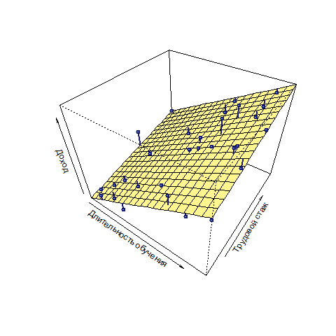
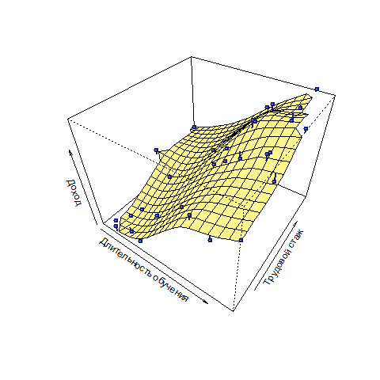
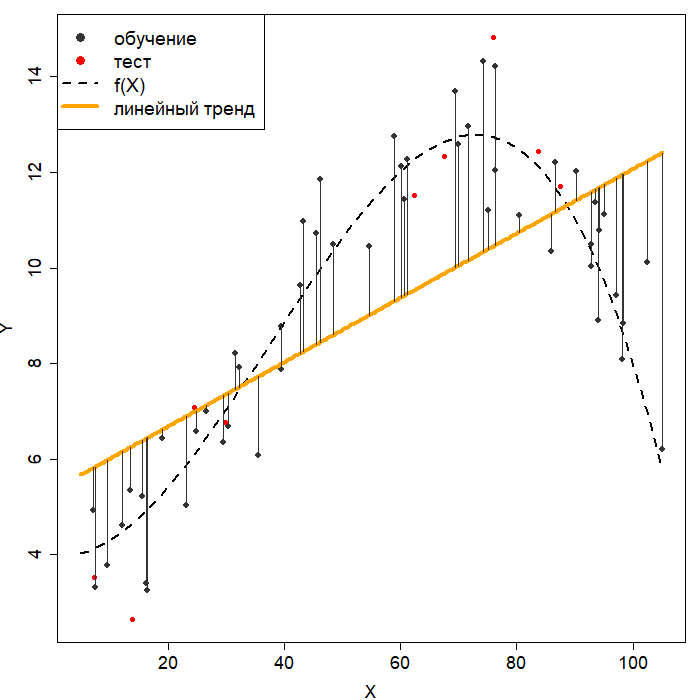
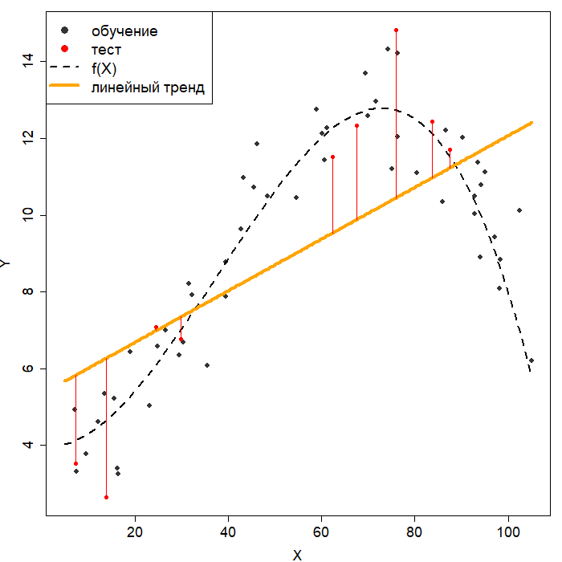
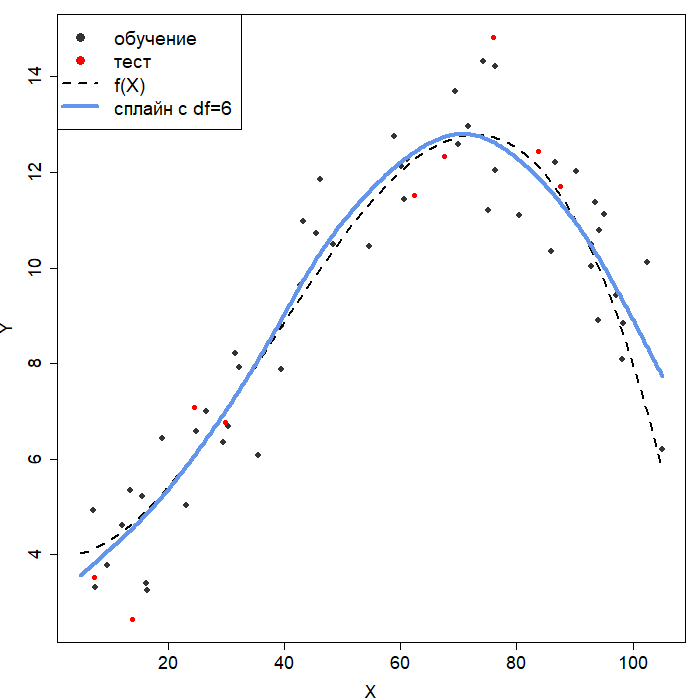
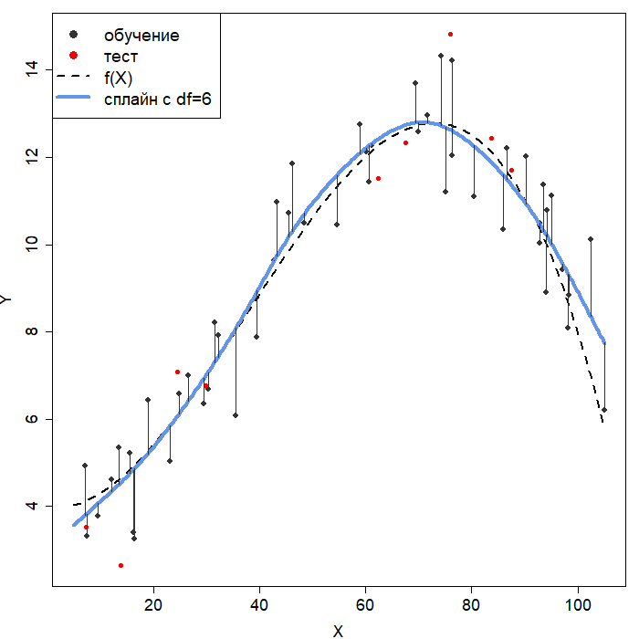
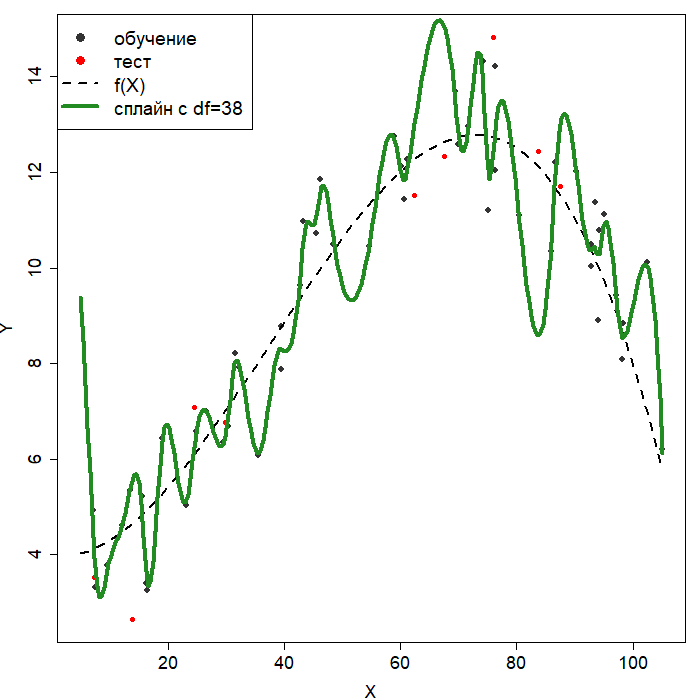
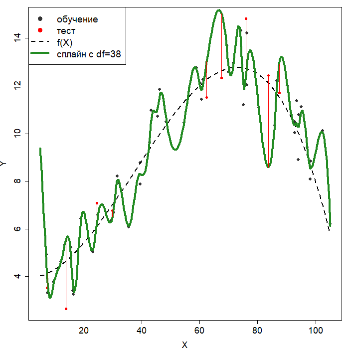
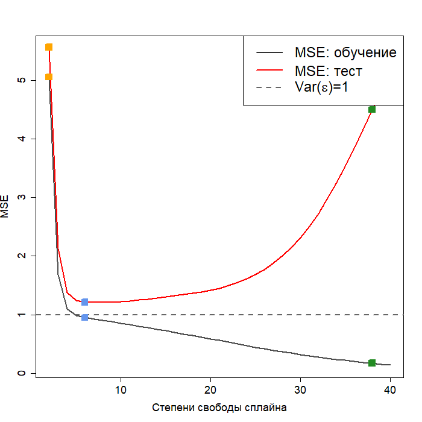

---
output:
  xaringan::moon_reader:
    css: ["./guu-slides-theme.css"]
    seal: false
    nature:
      ratio: '16:9'
      countIncrementalSlides: false
title: 'Lection-01'
---

```{r setup, include=FALSE}
options(htmltools.dir.version = FALSE)

library('icon')

```

class: inverse, center, middle  
background-image: url(./title_GERB-GUU_16-9.png)
background-size: cover

### Методы и технологии машинного обучения

## Лекция 1:  Введение в статистическое обучение

### Светлана Андреевна Суязова (Аксюк) </br> [s.aksuk@kiber-guu.ru](mailto:s.aksuk@kiber-guu.ru)  

осенний семестр 2021 / 2022 учебного года

```{r Подготовка рабочего пространства, include = F}
library('gtrendsR')
library('scatterplot3d')
library('fields')
library('splines')

eval(parse('./r-scripts/drawThreePlots.R', encoding = 'UTF-8'))
eval(parse('./r-scripts/lection-01_ex-01.R', encoding = 'UTF-8'))

```

---

.pull-left[

# План лекции   

- Что такое статистическое обучение  
--  
- Типы решаемых задач  
- Непрерывный $Y$: понятия, связанные с точностью модели  
- Дискретный $Y$: основные измерители точности  
- Литература и ресурсы    

]

.pull-right[


<div align = "left", style = "font-family: 'Courier New'; font-size: 50%"><a href = "https://xkcd.com/894/">xkcd.com/894</a></div>

]

---

.small[

Под **статистическим обучением** понимают огромный набор инструментов, предназначенных для *понимания данных*.   

<div align = "right", style = "font-family: 'Courier New';"><a href = "https://dmkpress.com/catalog/computer/statistics/978-5-97060-495-3/"> Джеймс Г., Уиттон Д., Хасти Т., Тибширани Р. Введение в статистическое обучение с примерами на языке R</a></div>

**Машинное обучение** – область практической деятельности и сфера научных исследований алгоритмов, извлекающих смысл из данных.   

<div align = "right", style = "font-family: 'Courier New';"><a href = "https://dmkpress.com/catalog/computer/data/978-5-97060-409-0/">Рашка С., Python и машинное обучение</a></div>

<!-- **Теория статистического обучения** (Statistical Learning Theory, SLT) изучает методы построения и анализа алгоритмов, обучаемых по прецедентам.  Термин **статистическое обучение** (Statistical Learning) употребляют как синоним машинного обучения (Machine Learning).   -->
<!-- <div align = "right", style = "font-family: 'Courier New';"><a href = "http://www.machinelearning.ru/wiki/index.php?title=%D0%A2%D0%B5%D0%BE%D1%80%D0%B8%D1%8F_%D1%81%D1%82%D0%B0%D1%82%D0%B8%D1%81%D1%82%D0%B8%D1%87%D0%B5%D1%81%D0%BA%D0%BE%D0%B3%D0%BE_%D0%BE%D0%B1%D1%83%D1%87%D0%B5%D0%BD%D0%B8%D1%8F">machinelearning.ru</a></div> -->

**Машинное обучение** – систематическое обучение алгоритмов и систем, в результате которого их знания или качество работы *возрастают с накоплением опыта*.    

<div align = "right", style = "font-family: 'Courier New';"><a href = "https://dmkpress.com/catalog/computer/data/978-5-97060-273-7/">Флах П. Машинное обучение</a></div>

**Data Science (наука о данных)** – междисциплинарная область, которая использует научные методы и алгоритмы для извлечения знаний из данных, представленных в различной форме, как структурированной, так и неструктурированной, аналогично *интеллектуальному анализу данных* (*Data Mining*).   
<div align = "right", style = "font-family: 'Courier New';"><a href = "https://en.wikipedia.org/wiki/Data_science">wiki</a></div>

]

---

.small[

<div align = 'left'>

<div align = "right", style = "font-family: 'Courier New';"><a href = 'https://trends.google.ru/trends/explore?date=today%205-y&q=machine%20learning,statistical%20learning'>Google тренды: динамика запросов "machine learning" и "statistical learning"</a></div>


<div align = "right", style = "font-family: 'Courier New';"><a href = 'https://trends.google.ru/trends/explore?date=today%205-y&q=machine%20learning,data%20science'>Google тренды: динамика запросов "machine learning" и "data science"</a></div>
</div>
]

---

<center></center>

<div align = "right", style = "font-family: 'Courier New'; font-size: 70%;"><a href = "http://starbridgepartners.com/2017/06/the-berkeley-science-review-how-to-become-a-data-scientist-before-you-graduate/">Anna Schneider, How to become a data scientist before you graduate</a></div>
<div align = "right", style = "font-family: 'Courier New'; font-size: 70%;"><a href = ""https://drewconway.com/zia/2013/3/26/the-data-science-venn-diagram"">drewconway.com/zia/2013/3/26/the-data-science-venn-diagram</a></div>

---

.small[

**Рабочий процесс машинного обучения**

**Предобработка**   
1. Сбор и подготовка данных. *Метки* – значения зависимой переменной, *признаки* – объясняющие переменные.    
   
**Обучение**   
2. Обучение модели на данных. *Модель* – отображение исходных данных на результаты.    
3. Оценка качества и производительности модели. *Тестовая* выборка – часть данных с известными значениями меток, которая не использовалась при обучении модели.    
4. Оптимизация модели. Подбор таких значений *параметров модели*, которые дают наименьшую ошибку на тестовой выборке.    
   
**Эксплуатация**   
5. Прогноз и/или интерпретация   
6. Непрерывное совершенствование модели  

<div align = "right", style = "font-family: 'Courier New'; font-size: 80%;">Бринк Х., Ричардс Д., Феверолф М. Машинное обучение; Рашка С. Python и машинное обучение</div>

]

---

**Формальное описание данных**  
Число наблюдений: $n$. Число переменных: $p$. </br>
$X$ – матрица независимых переменных (признаков)    
$Y$ – вектор-столбец значений зависимой переменной (меток)   
$x_i$ – вектор $i$-ого наблюдения (строка $X$)   
$\mathrm{x}_j$ – вектор $j$-ой переменной (столбец $X$)  

.small[

<table>
    <tr style="border:0;">
        <td style="border:0;">
$$
X = 
 \begin{pmatrix}
  x_{11} & \cdots & x_{1j} & \cdots & x_{1p} \\
  \vdots  & \ddots & \vdots & \ddots & \vdots  \\
  x_{i1} & \cdots & x_{ij} & \cdots & x_{ip} \\
  \vdots  & \ddots & \vdots & \ddots & \vdots  \\
  x_{n1} & \cdots & x_{nj} & \cdots & x_{np}
 \end{pmatrix} ,
$$
        </td>
    <td style="border:0;">
$$ 
y =
 \begin{pmatrix}
  y_{1} \\
  \vdots \\
  y_{i} \\
  \vdots \\
  y_{n}
 \end{pmatrix} .
$$
        </td>
    </tr>
</table>

]

---

**Обучение и тестирование**

Собственно построение модели:  
**обучающая выборка** (`train`), $n_{TRAIN}$ наблюдений   
   
Оценка точности модели (и *ошибки вне выборки*):  
**тестовая выборка** (`test`), $n_{TEST}$ наблюдений   

Модель: $Y = f(X) + \epsilon,$  
<em>где</em> $f(X)$ – систематическая составляющая,  $\epsilon$ – ошибка, не зависящая от $X$.  

**Параметрические методы** рассматривают $f(X)$ как функцию и оценивают её параметры. **Непараметрические методы** не делают предположений о форме $f(X)$.  

---

**Сравнение подходов**  

|     Характеристика     |    Параметрические методы   | Непараметрические методы |
|:----------------------:|:---------------------------:|:------------------------:|
| Возможность прогноза   |            есть             |           есть           |
| Статистический вывод   |            есть             |            нет           |
| Гибкость модели        | регулируется формой функции | регулируется настроечными параметрами |
| Модель интерпретируема   | почти всегда           |     почти никогда        |

---

.small[
Пример на данных <font face = "Courier New", color = "brown">Income {ISLR}</font>

```{r plot-01, include = F, cache = T}
# данные
df.income <- read.csv('https://raw.githubusercontent.com/ranalytics/islr-ru/master/Data/Income2.csv', sep = ',', dec = '.')

# разворот и масштаб графика
.theta = 35
.phi = 40
.expand = 0.8

# параметрическая модель
param.model <- lm(Income ~ Education + Seniority, data = df.income)

# plot 1
png(file = './plots/lection-01_plot-01.png')

x.seq <- seq(min(df.income$Education), max(df.income$Education), length = 20)
y.seq <- seq(min(df.income$Seniority), max(df.income$Seniority), length = 20)
persp(x = x.seq,
      y = y.seq,
      z = outer(x.seq, y.seq, function (a, b) predict(param.model, newdata = data.frame(Education = a, Seniority = b))),
      xlab = 'Длительность обучения', ylab = 'Трудовой стаж', zlab = 'Доход',
      col = 'khaki1',
      theta = .theta, phi = .phi, expand = .expand) -> res
obs <- trans3d(df.income$Education, 
               df.income$Seniority, 
               df.income$Income, pmat = res)
pred  <- trans3d(df.income$Education, 
               df.income$Seniority, 
               fitted(param.model), pmat = res)
segments(obs$x, obs$y, pred$x, pred$y, lwd = 2, col = 'midnightblue')
points(obs, bg = 'steelblue1', col = 'midnightblue', 
       pch = 21, lwd = 2)

dev.off()

```

.pull-left[

Параметрическая модель: линейная регрессия
]

```{r plot-02, include = F}
# непараметрическая модель
nonparam.model <- Tps(as.matrix(data.frame(Education = df.income$Education,
                                           Seniority = df.income$Seniority)),
                                df.income$Income)
pred.surf <- predictSurface(nonparam.model, nx = 20, ny = 20,  verbose = FALSE)

# plot 2
png(file = './plots/lection-01_plot-02.png')

persp(pred.surf, 
      xlab = 'Длительность обучения', ylab = 'Трудовой стаж', zlab = 'Доход',
      col = 'khaki1',
      theta = .theta, phi = .phi, expand = .expand) -> res
obs <- trans3d(df.income$Education, 
               df.income$Seniority, 
               df.income$Income, pmat = res)
pred  <- trans3d(df.income$Education, 
               df.income$Seniority, 
               nonparam.model$fitted.values, pmat = res)
segments(obs$x, obs$y, pred$x, pred$y, lwd = 2, col = 'midnightblue')
points(obs, bg = 'steelblue1', col = 'midnightblue', 
       pch = 21, lwd = 2)

dev.off()

```

.pull-right[

Непараметрическая модель: сплайн "тонкая пластина"
]]

---

# План лекции   

- Что такое статистическое обучение  
- Типы решаемых задач  
--  
- Непрерывный $Y$: понятия, связанные с точностью модели  
- Дискретный $Y$: основные измерители точности  
- Литература и ресурсы    

---

**Классификация и регрессия**  

$Y$ непрерывный (среднемесячный доход в рублях) – **задача регрессии**.  

$Y$ дискретный (уровень дохода: "высокий", "средний", "низкий") – **задача классификации**.  

Большинство методов подходят для решения задач либо классификации, либо регрессии, но граница не жёсткая.   

---

<h3>Регрессия (<font color = 'blue'>Р</font>) или классификация (<font color = 'blue'>К</font>)?</h3>

<small>
<ol>
<li>Прогноз и выявление факторов повторного инфаркта по показателям демографии, диеты, анализов. Зависимая переменная ( $Y$ ): вероятность инфаркта.</li>
<li>Прогноз повторного инфаркта. $Y$: факт инфаркта.</li>
<li>Распознавание рукописных цифр. $Y$ – шаблоны написания цифр.</li>
<li>Выявление в данных признаков, которые являются факторами риска возникновения определённого вида рака по клиническим и демографическим переменным. $Y$ – вероятность болезни.</li>
<li>Прогноз и интерпретация рейтинга надёжности банка по финансовым показателям (методика рейтингования не задана, позиции шкалы рейтинга неизвестны).</li>
</ol>
</small>

---

**Прогноз и статистический вывод**

Предсказание $Y$ для новых значений $X$ – **задача прогноза**.  

Интерпретация влияния признаков $\mathrm{x}_j$ на $Y$ по модели $Y$ – **задача статистического вывода**.   

Статистический вывод может предшествовать построению модели – это применение техник преобразования пространства признаков на этапе предварительного анализа данных.   

---

<h3>Прогноз (<font color = 'blue'>П</font>) или статистический вывод (<font color = 'blue'>СВ</font>)?</h3>

<small>
<ol>
<li>Прогноз и выявление факторов повторного инфаркта по показателям демографии, диеты, анализов. Зависимая переменная ( $Y$ ): вероятность инфаркта.</li>
<li>Прогноз повторного инфаркта. $Y$: факт инфаркта.</li>
<li>Распознавание рукописных цифр. $Y$ – шаблоны написания цифр.</li>
<li>Выявление в данных признаков, которые являются факторами риска возникновения определённого вида рака по клиническим и демографическим переменным. $Y$ – вероятность болезни.</li>
<li>Прогноз и интерпретация рейтинга надёжности банка по финансовым показателям (методика рейтингования не задана, позиции шкалы рейтинга неизвестны).</li>
</ol>
</small>

---

**Обучение с учителем и без учителя**   

Обучение с учителем (*supervised learning*): в обучающей выборке известны значения $Y$.   

Обучение без учителя (*unsupervised learning*): значения $Y$ неизвестны.  
- кластерный анализ   
- обобщение   
- ассоциативные правила   
- снижение размерности   
- визуализация   

---

<h3>Обучение с учителем (<font color = 'blue'>У</font>) обучение или без учителя (<font color = 'blue'>БУ</font>)?</h3>

<small>
<ol>
<li>Прогноз и выявление факторов повторного инфаркта по показателям демографии, диеты, анализов. Зависимая переменная ( $Y$ ): вероятность инфаркта.</li>
<li>Прогноз повторного инфаркта. $Y$: факт инфаркта.</li>
<li>Распознавание рукописных цифр. $Y$ – шаблоны написания цифр.</li>
<li>Выявление в данных признаков, которые являются факторами риска возникновения определённого вида рака по клиническим и демографическим переменным. $Y$ – вероятность болезни.</li>
<li>Прогноз и интерпретация рейтинга надёжности банка по финансовым показателям (методика рейтингования не задана, позиции шкалы рейтинга неизвестны).</li>
</ol>
</small>

---

**Выбор и применение метода обучения с учителем**    

* Нужен прогноз или статистический вывод?  
* Зависимая переменная ( $Y$ ) непрерывная или дискретная?


<table>
<small>

<tr>
<td>
<b>Параметрические методы</b>
<ol>
<li><em>Подготовка</em>: выбрать форму функции</li></br>
<li><em>Подгонка</em>: оценить параметры модели, проверить значимость</li>
<li><em>Валидация</em>: оценить точность</li>
</ol>
</td>

<td>
<b>Непараметрические методы</b>
<ol>
<li><em>Подготовка</em>: выбрать значения настроечных параметров</li>
<li><em>Подгонка</em>: аппроксимировать обучающие данные</li></br>
<li><em>Валидация</em>: оценить точность</li></br>
</ol>
</td>
</tr>

</small>
</table>

---

# План лекции   

- Что такое статистическое обучение  
- Типы решаемых задач  
- Непрерывный $Y$: понятия, связанные с точностью модели  
--  
- Дискретный $Y$: основные измерители точности  
- Литература и ресурсы  

---

## Точность модели

**Непрерывный $Y$**

Ошибка на обучающей выборке:   

$$MSE = \frac{1} {n_{TRAIN}} \sum\limits_{i \in TRAIN} \left(y_{i} - \hat{f}(x_{i})\right)^{2}$$

Ошибка на тестовой выборке:   

$$MSE_{test} = \frac{1} {n_{TEST}} \sum\limits_{i \in TEST} \left(y_{i} - \hat{f}(x_{i})\right)^{2}$$

---


.small[
**Данные для примера №1**

.pull-left[
Сгенерируем $X$ и $Y$:

* $X \sim U(5, 105)$ (равномерное распределение)  
* $Y = f(X) + \epsilon$, где   

$$f(X) = 4 - 0.02X + 0.0055X^2 - \\ - 4.9 \cdot 10^{-5} \cdot X^3$$

$\epsilon \sim N(0, 1)$ (нормальное распределение)  

Количество наблюдений: `r n.all`.  
Доля обучающей выборки: `r train.percent*100`%.

**Неустранимая ошибка**: $Var(\epsilon)=1$.  
]

.pull-right[
<div align = 'center'></div>
]]

---

**Гибкость модели** ~ число степеней свободы   

<div align = 'center'></div>

1. Линейная регрессия (2 степени свободы)   
1. Сплайн с `r spline.1.df` степенями свободы   
2. Сплайн с `r spline.2.df` степенями свободы   

*Рассмотрим практический пример №1.*   

---

.left-column[
1. Линейный тренд
]

.right-column[
<div align = 'center'></div>
]

---

.left-column[
1. Линейный тренд    
$\color{grey} {MSE = `r round(MSE.1['train'], 2)`}$   
]

.right-column[
<div align = 'center'></div>
]

---

.left-column[
1. Линейный тренд    
$\color{grey} {MSE = `r round(MSE.1['train'], 2)`}$   
$\color{red} {MSE_{TEST} = `r round(MSE.1['test'], 2)`}$  
]

.right-column[
<div align = 'center'></div>
]

---

.left-column[
1. Линейный тренд    
$\color{grey} {MSE = `r round(MSE.1['train'], 2)`}$   
$\color{red} {MSE_{TEST} = `r round(MSE.1['test'], 2)`}$  
  
2. Сплайн с $df = `r spline.1.df`$
]

.right-column[
<div align = 'center'></div>
]

---

.left-column[
1. Линейный тренд    
$\color{grey} {MSE = `r round(MSE.1['train'], 2)`}$   
$\color{red} {MSE_{TEST} = `r round(MSE.1['test'], 2)`}$  
  
2. Сплайн с $df = `r spline.1.df`$  
$\color{grey} {MSE = `r round(MSE.2['train'], 2)`}$  
]

.right-column[
<div align = 'center'></div>
]

---

.left-column[
1. Линейный тренд    
$\color{grey} {MSE = `r round(MSE.1['train'], 2)`}$   
$\color{red} {MSE_{TEST} = `r round(MSE.1['test'], 2)`}$  
  
2. Сплайн с $df = `r spline.1.df`$  
$\color{grey} {MSE = `r round(MSE.2['train'], 2)`}$   
$\color{red} {MSE_{TEST} = `r round(MSE.2['test'], 2)`}$  
]

.right-column[
<div align = 'center'></div>
]

---

.left-column[
1. Линейный тренд    
$\color{grey} {MSE = `r round(MSE.1['train'], 2)`}$   
$\color{red} {MSE_{TEST} = `r round(MSE.1['test'], 2)`}$  
  
2. Сплайн с $df = `r spline.1.df`$  
$\color{grey} {MSE = `r round(MSE.2['train'], 2)`}$   
$\color{red} {MSE_{TEST} = `r round(MSE.2['test'], 2)`}$   
  
3. Сплайн с $df = `r spline.2.df`$  
]

.right-column[
<div align = 'center'></div>
]

---

.left-column[
1. Линейный тренд    
$\color{grey} {MSE = `r round(MSE.1['train'], 2)`}$   
$\color{red} {MSE_{TEST} = `r round(MSE.1['test'], 2)`}$  
  
2. Сплайн с $df = `r spline.1.df`$  
$\color{grey} {MSE = `r round(MSE.2['train'], 2)`}$   
$\color{red} {MSE_{TEST} = `r round(MSE.2['test'], 2)`}$   
  
3. Сплайн с $df = `r spline.2.df`$   
$\color{grey} {MSE = `r round(MSE.3['train'], 2)`}$  
]

.right-column[
<div align = 'center'></div>
]

---

.left-column[
1. Линейный тренд    
$\color{grey} {MSE = `r round(MSE.1['train'], 2)`}$   
$\color{red} {MSE_{TEST} = `r round(MSE.1['test'], 2)`}$  
  
2. Сплайн с $df = `r spline.1.df`$  
$\color{grey} {MSE = `r round(MSE.2['train'], 2)`}$   
$\color{red} {MSE_{TEST} = `r round(MSE.2['test'], 2)`}$   
  
3. Сплайн с $df = `r spline.2.df`$   
$\color{grey} {MSE = `r round(MSE.3['train'], 2)`}$   
$\color{red} {MSE_{TEST} = `r round(MSE.3['test'], 2)`}$   
]

.right-column[
<div align = 'center'></div>
]

---

.small[
**Сравнение точности моделей**

Данные примера №1: $f(X) = 4 - 0.02X + 0.0055X^2 - 4.9 \cdot 10^{-5} \cdot X^3$    
]

.pull-left[

]

.pull-right[
  
]

---

**Смещение и дисперсия**  

$$E(y_0 - \hat{f}(x_0))^2 = Var( \hat{f}(x_0)) + \\ + [Bias( \hat{f}(x_0))]^2  + Var( \epsilon )$$  

* $E(y_0 - \hat{f}(x_0))^2$ – математическое ожидание ошибки на тестовой выборке;  
* $Var( \hat{f}(x_0))$ – **дисперсия модели**;  
* $[Bias( \hat{f}(x_0))]^2$ – **квадрат смещения модели**;  
* $Var( \epsilon )$ – дисперсия случайной составляющей (неустранимая ошибка).

---

**Смещение и дисперсия наглядно**

.center[


.small[
*Слева: данные, справа: модель с небольшим числом степеней свободы*
]

Высокое смещение модели, низкая дисперсия модели  
]

---

**Смещение и дисперсия наглядно**

.center[


.small[
*Слева: данные, справа: модель со средним числом степеней свободы (попали в форму функции)*
]

Низкое смещение модели, средняя дисперсия модели  
]

---

**Смещение и дисперсия наглядно**

.center[


.small[
*Слева: данные, справа: модель с высоким (избыточным) числом степеней свободы*
]

Низкое смещение модели (на обучающей!), высокая дисперсия  
]

---

.small[

**План лекции**   

.pull-left[
- Что такое статистическое обучение  
- Типы решаемых задач  
- Непрерывный $Y$: понятия, связанные с точностью модели  
- Дискретный $Y$: основные измерители точности  
--  
- Литература и ресурсы    
]

.pull-right[

<div align = "left", style = "font-family: 'Courier New'; font-size: 70%"><a href = "http://www.mrlovenstein.com/comic/643">www.mrlovenstein.com/comic/643</a></div>
]
]

---

.small[
**Задача классификации с учителем**

$Y$ – качественная переменная: $Y = \{1, 2, ..., C\}, C \geqslant 2$ – метки классов $\omega_1, \omega_2,...,\omega_C$.   

Ошибка модели – оценка *частоты ошибок классификации*:  

$$\begin{array}{ccc} E_{TRAIN} = {1 \over n_{TRAIN}}  \cdot \sum \limits_{i \in TRAIN} I(y_i \neq \hat{y}_i) & ; & E_{TEST} = {1 \over n_{TEST}}  \cdot \sum \limits_{i \in TEST} I(y_i \neq \hat{y}_i) \end{array}$$

$$I(y_i \neq \hat{y}_i) = \begin{cases} 0, & y_i = \hat{y}_i, \\ 1, & y_i \neq \hat{y}_i. \end{cases}$$

Матрица неточностей (*confusion matrix*), или таблица сопряжённости:  

$$M = \{ m_{ij} \} _{i, j = 1}^C$$
– показывает количество объектов, принадлежащих классу $\omega_i$ ( $i$ – номер строки) и отнесённых моделью к классу $\omega_j$ ( $j$ – номер столбца). 
]

---

**Задача классификации с учителем**

Если $Y$ – **бинарная** переменная: $Y = \{0, 1 \}$, размерность матрицы неточностей 2x2:  

<div align = 'center'>
<table>

<tr>
<td colspan = "2" rowspan = "2">
</td>
<td colspan="2" style = "text-align:center; vertical-align:middle;">
<em>Предсказанное значение</em> $\hat{Y}$
</td>
</tr>

<tr>
<td style = "text-align:center; vertical-align:middle;">
– $(H_0)$
</td>
<td style = "text-align:center; vertical-align:middle;">
+ $(H_1)$
</td>
</tr>

<tr>
<td rowspan="2" style = "text-align:center; vertical-align:middle;">
<em>Истинное значение</em> $Y$
</td>
<td style = "text-align:center; vertical-align:middle;">
– $(H_0)$
</td>
<td style = "text-align:center; vertical-align:middle;border-left: 5px solid #000000;border-top: 5px solid #000000;">
<b>TN</b>
</td>
<td style = "text-align:center; vertical-align:middle;border-top: 5px solid #000000;border-right: 5px solid #000000;">
<b>FP</b>
</td>
</tr>

<tr>
<td style = "text-align:center; vertical-align:middle;">
+ $(H_1)$
</td>
<td style = "text-align:center; vertical-align:middle;border-left: 5px solid #000000;border-bottom: 5px solid #000000;">
<b>FN</b>
</td>
<td style = "text-align:center; vertical-align:middle;border-bottom: 5px solid #000000;border-right: 5px solid #000000;">
<b>TP</b>
</td>
</tr>

</table>
</div>

"+" означает наличие признака; "–" – отсутствие признака.  
**TN** – истинно отрицательные случаи, **FP** – ложноположительные, **FN** – ложноотрицательные, **TP** – истинно положительные.  

---

<div align = 'center'>
<table>

<tr>
<td colspan = "2" rowspan = "2">
</td>
<td colspan="2" style = "text-align:center; vertical-align:middle;">
<em>Предсказанное значение $\hat{Y}$</em>
</td>
</tr>

<tr>
<td style = "text-align:center; vertical-align:middle;">
– $(H_0)$
</td>
<td style = "text-align:center; vertical-align:middle;">
+ $(H_1)$
</td>
</tr>

<tr>
<td rowspan="2" style = "text-align:center; vertical-align:middle;">
<em>Истинное значение $Y$</em>
</td>
<td style = "text-align:center; vertical-align:middle;">
– $(H_0)$
</td>
<td style = "text-align:center; vertical-align:middle;border-left: 5px solid #000000;border-top: 5px solid #000000;" class = "mark2">
<b>TN</b>
</td>
<td style = "text-align:center; vertical-align:middle;border-top: 5px solid #000000;border-right: 5px solid #000000;" class = "mark2">
<b>FP</b>
</td>
</tr>

<tr>
<td style = "text-align:center; vertical-align:middle;">
+ $(H_1)$
</td>
<td style = "text-align:center; vertical-align:middle;border-left: 5px solid #000000;border-bottom: 5px solid #000000;" class = "mark1">
<b>FN</b>
</td>
<td style = "text-align:center; vertical-align:middle;border-bottom: 5px solid #000000;border-right: 5px solid #000000;" class = "mark1">
<b>TP</b>
</td>
</tr>

</table>
</div>

Чувствительность (*sensitivity*, *TP rate*, *recall*):  
$$\color{magenta}{TPR} = P(\textrm{модель:} + | \, \textrm{факт:} +) = {TP \over (TP + FN)}$$

Специфичность (*specificity*, *TN rate*):  
$$\color{lime}{SPC} = P(\textrm{модель:} - | \, \textrm{факт:} -) = {TN \over (TN + FP)}$$

---

<div align = 'center'>
<table>

<tr>
<td colspan = "2" rowspan = "2">
</td>
<td colspan="2" style = "text-align:center; vertical-align:middle;">
<em>Предсказанное значение $\hat{Y}$</em>
</td>
</tr>

<tr>
<td style = "text-align:center; vertical-align:middle;">
– $(H_0)$
</td>
<td style = "text-align:center; vertical-align:middle;">
+ $(H_1)$
</td>
</tr>

<tr>
<td rowspan="2" style = "text-align:center; vertical-align:middle;">
<em>Истинное значение $Y$</em>
</td>
<td style = "text-align:center; vertical-align:middle;">
– $(H_0)$
</td>
<td style = "text-align:center; vertical-align:middle;border-left: 5px solid #000000;border-top: 5px solid #000000;"  class = "mark4">
<b>TN</b>
</td>
<td style = "text-align:center; vertical-align:middle;border-top: 5px solid #000000;border-right: 5px solid #000000;" class = "mark3">
<b>FP</b>
</td>
</tr>

<tr>
<td style = "text-align:center; vertical-align:middle;">
+ $(H_1)$
</td>
<td style = "text-align:center; vertical-align:middle;border-left: 5px solid #000000;border-bottom: 5px solid #000000;" class = "mark4">
<b>FN</b>
</td>
<td style = "text-align:center; vertical-align:middle;border-bottom: 5px solid #000000;border-right: 5px solid #000000;" class = "mark3">
<b>TP</b>
</td>
</tr>

</table>
</div>

Ценность положит-ого прогноза (*positive predictive value*, *precision*):  

$$\color{red}{PPV} = P(\textrm{факт:} + | \, \textrm{модель:} +) = {TP \over (TP + FP)}$$  

Ценность отрицательного прогноза (*negative predictive value*):  

$$\color{blue}{NPV} = P(\textrm{факт:} - | \, \textrm{модель:} -) = {TN \over (TN + FN)}$$

---

**Ошибки**  

Доля ложноотрицательных исходов (*FN rate*):  
  
$$FNR = 1 - TPR$$

Доля ложных срабатываний (*fall-out rate*, *FP rate*):  
  
$$FPR = 1 - SPC$$  

Доля ложного обнаружения (*false discovery rate*):  
  
$$FDR = 1 - PPV$$

<small><em>чем ниже, тем лучше</em></small>

---

.small[

**Сводные характеристики качества**   

Точность, или верность (*Accuracy*):  

$$Acc = P(y_i = j \, | \, y_i \in \omega_j) = {(TP + TN) \over (TP + FP + TN + FN)}$$   

F-мера – гармоническое среднее ценности положительного прогноза и чувствительности:   

$$F1 = {2 \over ({1 \over PPV} + {1 \over TPR})}$$   

Корреляция Мэтьюса (* $\phi$-коэффициент*):  

$$\begin{array}{} MCC = {TP \cdot TN - FP \cdot FN \over \sqrt{(TP + FP)(TP + FN)(TN + FP)(TN + FN)}}; & MCC \in [-1, \, 1] \end{array}$$  

- $MCC = -1$: предсказанные классы противоположны истинным;  
- $MCC = 0$: предсказанные классы не связаны с истинными (случайны);  
- $MCC = 1$: предсказанные классы идеально совпадают с истинными.  
]

---

# План лекции   

- Что такое статистическое обучение  
- Типы решаемых задач  
- Непрерывный $Y$: понятия, связанные с точностью модели  
- Дискретный $Y$: основные измерители точности  
- Литература и ресурсы    
--  

---

.small[

**Литература**  

- *Рашка С.* Python и машинное обучение: крайне необходимое пособие по новейшей предсказательной аналитике, обязательное для более глубокого понимания методологии машинного обучения / пер. с англ. А.В. Логунова. – М.: ДМК Пресс, **2017**. – 418 с.: ил. Репозиторий с примерами к книге (англ.): [https://github.com/rasbt/python-machine-learning-book-2nd-edition](https://github.com/rasbt/python-machine-learning-book-2nd-edition)

- *Джеймс Г., Уиттон Д., Хасти Т., Тибширани Р.* Введение в статистическое обучение с примерами на языке R / пер. с англ. С.Э. Мастицкого. – М.: ДМК Пресс, **2016** – 450 с. Репозиторий с примерами к книге на русском языке: [https://github.com/ranalytics/islr-ru](https://github.com/ranalytics/islr-ru)      

- *Флах П.* Машинное обучение. Наука и искусство построения алгоритмов, которые извлекают знания из данных / пер. с англ. А.А.Слинкина. – М.: ДМК Пресс, **2015**. – 400 с.   

- *Бринк Х., Ричардс Дж., Феверолф М.* Машинное обучение. – Спб.: Питер, **2018**. – 336 с.   

- *Анналин Ын, Кеннет Су* Теоретический минимум по Big Data. Всё, что нужно знать о больших данных. – Спб.: Питер, **2019**. – 208 с. 

]

---

.small[

**Онлайн ресурсы**

- [Open Data Science на habr.com](https://habr.com/ru/company/ods/blog/)   

- Списки ресурсов по ML на английском: [github.com/josephmisiti/awesome-machine-learning](github.com/josephmisiti/awesome-machine-learning)

- Cкрипты к практикам: [XXX](XXX)   

- Cлайды к лекциям: [XXX](XXX)   

  
  
**Что установить**  

- [Anaconda Python не ниже версии 3.8](https://www.anaconda.com/products/individual)  


**Где завести аккаунты**   

- [github.com](https://github.com/)  

- [kaggle.com](https://www.kaggle.com/)  
]
