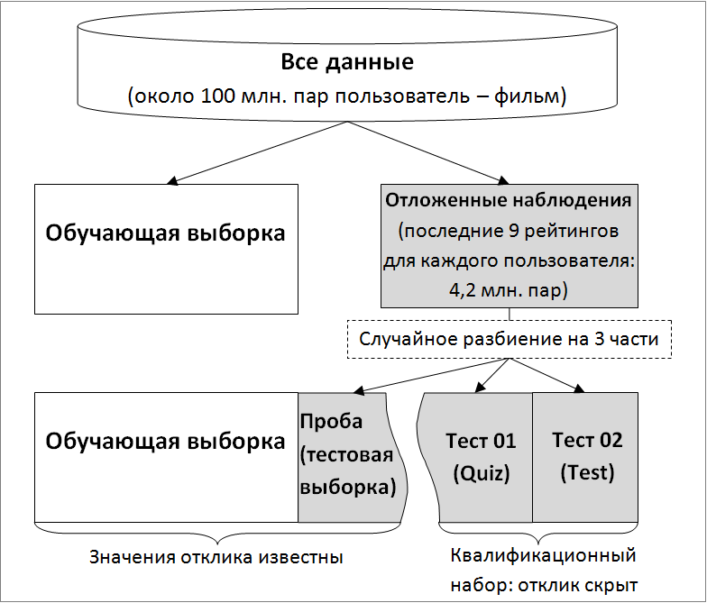

---
output:
  xaringan::moon_reader:
    css: ["./guu-slides-theme.css"]
    seal: false
    nature:
      ratio: '16:9'
      countIncrementalSlides: false
title: 'Lection-01'
---

```{r setup, include=FALSE}
options(htmltools.dir.version = FALSE)

```

class: inverse, center, middle  
background-image: url(./title_GERB-GUU_16-9.png)
background-size: cover

### Методы и технологии машинного обучения

## Лекция 2:  Параметрические классификаторы для бинарной $Y$  

### Светлана Андреевна Суязова (Аксюк) </br> [sa_aksyuk@guu.ru](mailto:sa_aksyuk@guu.ru)  

осенний семестр 2021 / 2022 учебного года

```{r Подготовка рабочего пространства, include = F}
library('knitr')
library('Cairo')
library('DiscriMiner')

my.seed <- 12345
train.percent <- 0.85

# eval(parse('./r-scripts/drawThreePlots.R', encoding = 'UTF-8'))
# eval(parse('./r-scripts/lection-01_ex-01.R', encoding = 'UTF-8'))

```

---

.pull-left[

# План лекции   

- Логистическая регрессия  
--
- Линейный дискриминантный анализ
- Порог отсечения классов и ROC-кривая  
- Квадратичный дискриминантный анализ
- Методы создания повторных выборок  

]

.pull-right[


<div align = "left" style = "font-family: 'Courier New'; font-size: 70%"><a href = "http://ru-xkcd.livejournal.com/75022.html">ru-xkcd.livejournal.com/75022.html</a></div>

]

---

## Почему не обычная регрессия?  

$Y$ – категориальная переменная, например, вид ириса:

$Y = \left\{ \begin{array}{lr} 1, & setosa \\ 2, & versicolor \\ 3, & virginica \\ \end{array} \right.$

Вопросы:   

1. Расстояние между категориями?  
2. Порядок категорий?  

$Y$ – категория; 1, 2, 3 – *метки*  

---

## Почему не обычная регрессия?   

$Y$ – категория; 1, 2, ... – *метки*  

*Две категории* – **логистическая регрессия**  
- $Y$ – бинарный (0 – отсутствие признака; 1 – наличие признака). $Y$ интерпретируется как принадлежность одному из классов; нужно задать порог отсечения.  
- $Y$ – оценка вероятности (частость), $Y \in [0, 1]$. $Y$ интерпретируется как вероятность принадлежности одному из классов.  

*Более двух категорий* – нерегрессионные модели.   

---

## Логистическая регрессия  

На примере данных по кредитным картам <font face = "Courier New", color = "brown">Default</font>  

Сгенерированные данные по 10000 держателям кредитных карт. Переменные:  
- `default` – категории дефолта по карте (да / нет);  
- `student` – является ли держатель карты студентом (да / нет);  
- `balance` – баланс кредитной карты, который останется после списания ежемесячного платежа;  
- `income` – доход держателя карты.  

---

## Логистическая регрессия   

Данные по кредитным картам <font face = "Courier New", color = "brown">Default</font>  

```{r, echo = F}
library('ISLR')

kable(head(Default))

```

Задача: предсказать `default` по `balance`.  

---

## Логистическая регрессия  

Зависимая переменная модели – условная вероятность:  

$Y = P(\mathrm{default} = \mathrm{Yes} | \mathrm{balance})$

 
$P(X) = \hat{\beta}_0 + \hat{\beta}_1 \cdot X$

Логистическая функция возвращает для любого X значение из интервала от 0 до 1:  

$$
P(X) = {e^{\hat{\beta}_0 + \hat{\beta}_1 \cdot X} \over 1 + e^{\hat{\beta}_0 + \hat{\beta}_1 \cdot X}}
$$

---

```{r plot-01-02, include = F, cache = T}
df <- Default
df$default <- as.numeric(df$default)
df$default <- df$default - 1
# обычная регрессия
fit.lm <- lm(default ~ balance, data = df)
# график 1
Cairo('./plots/lection-02_plot-01.png', width = 600, height = 600)
par(mar = c(5, 5, 1, 1))
plot(df$balance, df$default, pch = '|', col = rgb(1, 0.6, 0, alpha = 0.5),
     xlab = 'Баланс (balance)', 
     ylab = paste0('Вероятность дефолта: ', expression(P(default = Yes))),
     ylim = c(-0.1, 1.1),
     cex = 2, cex.axis = 2, cex.lab = 2, cex.text = 2)
abline(h = c(0, 1), lty = 2, lwd = 3)
abline(fit.lm, col = 'blue', lwd = 3)
legend(x = 1800, y = 0.9, pch = c('|', NA), 
       col = c(col = rgb(1, 0.6, 0, alpha = 1), 'blue'),
       lwd = c(NA, 3), lty = c(NA, 1), legend = c('факт', 'модель'),
       cex = 2)
dev.off()

# логистическая регрессия
fit.log <- glm(default ~ balance, data = df, family = 'binomial')
# график 2
Cairo('./plots/lection-02_plot-02.png', width = 600, height = 600)
par(mar = c(5, 5, 1, 1))
plot(df$balance, df$default, pch = '|', col = rgb(1, 0.6, 0, alpha = 0.5),
     xlab = 'Баланс (balance)', 
     ylab = paste0('Вероятность дефолта: ', expression(P(default = Yes))),
     ylim = c(-0.1, 1.1),
     cex = 2, cex.axis = 2, cex.lab = 2, cex.text = 2)
abline(h = c(0, 1), lty = 2, lwd = 3)
seq.x <- seq(-50, 3000, length = 200)
lines(seq.x, predict(fit.log, data.frame(balance = seq.x), 
                     type = 'response'), 
      col = 'blue', lwd = 3)
dev.off()
```

.pull-left[

<small><em>Обычная линейная регрессия</em></small>
]

.pull-right[

<small><em>Логистическая регрессия</em></small>
]

---

## Логистическая регрессия  

$$
P(X) = {e^{\hat{\beta}_0 + \hat{\beta}_1 \cdot X} \over 1 + e^{\hat{\beta}_0 + \hat{\beta}_1 \cdot X}} \Leftrightarrow {P(X) \over 1 - P(X)} = e^{\hat{\beta}_0 + \hat{\beta}_1 \cdot X}
$$

${P(X) \over 1 - P(X)} \in (0, \infty)$ – **риск события**:

Например: если $P(X) = 0.8$, это означает, что 8 из 10 человек станут неплательщиками с риском:
$$
{P(X) \over 1 - P(X)} = {0.8 \over 1 - 0.8} = 4
$$  

---

## Логистическая регрессия  

$$
\mathrm{ln} \bigg( {P(X) \over 1 - P(X)} \bigg) = \mathrm{ln} \Big( e^{\hat{\beta}_0 + \hat{\beta}_1 \cdot X} \Big) \Leftrightarrow 
\mathrm{ln} \bigg( {\color{blue}{P(X)} \over 1 - \color{blue}{P(X)}} \bigg) = \hat{\beta}_0 + \color{blue} {\hat{\beta}_1} \cdot X
$$

$\mathrm{ln} \bigg( {P(X) \over 1 - P(X)} \bigg)$ – логарифм риска, или *логит*.  

- коэффициент $\hat{\beta}_1$ *не отражает изменение $P(X)$, вызванное увеличением $X$ на 1*;  
- скорость изменения $P(X)$ с изменением $X$ на 1 зависит от текущего значения $X$;  
- направление связи интерпретируется как в линейной регрессии: если $\hat{\beta}_1$ > 0, $X \uparrow \uparrow P(X)$; если $\hat{\beta}_1$ < 0, $X \uparrow \downarrow P(X)$.   

---

### Логистическая регрессия: оценка параметров  

*Принцип метода максимального правдоподобия*: подобрать $\hat{\beta}_0$, $\hat{\beta}_1$ так, чтобы вероятность дефолта $\hat{p}(x_i)$ для каждого держателя карты максимально близко соответствовала его наблюдаемому статусу.  

*Функция правдоподобия:*  

$\ell(\beta_0, \beta_1) = \prod_{i: y_i = 1}{p(x_i)} \prod_{i': y_{i'} = 0}{(1 - p(x_{i'}))} \rightarrow \mathrm{max}$

МНК в линейной регрессии – частный случай ММП.  

---

<b>На примере данных <font face = "Courier New", color = "brown">Default</font></b>

.small[

```{r echo = F}
tbl <- as.data.frame(summary(fit.log)$coeff)
tbl[, 1] <- round(tbl[, 1], 4)
tbl[, 2] <- round(tbl[, 2], 2)
tbl[, 3] <- round(tbl[, 3], 2)
tbl[, 4] <- formatC(round(tbl[, 4], 4), digits = 4, format = 'f')

kable(tbl)

```

Информационный коэффициент Акаике: `r paste0('$AIC = ', round(summary(fit.log)$aic, 2), '$')`  

$$
\mathrm{ln} \bigg( {P(X) \over 1 - P(X)} \bigg) = `r round(coef(fit.log)[1], 4)` `r ifelse(coef(fit.log)[2] < 0, '', '+')` `r round(coef(fit.log)[2], 4)` \cdot \mathrm{balance}
$$
**Прогнозы**

Вероятность дефолта для $\mathrm{balance} = 1000$: $\hat{p}(1000) = {e^{`r round(coef(fit.log)[1], 4)` `r ifelse(coef(fit.log)[2] < 0, '', '+')` `r round(coef(fit.log)[2], 4)` \cdot 1000} \over 1 + e^{`r round(coef(fit.log)[1], 4)` `r ifelse(coef(fit.log)[2] < 0, '', '+')` `r round(coef(fit.log)[2], 4)` \cdot 1000}} \approx `r round(predict(fit.log, newdata = data.frame(balance = 1000), type = 'response'), 3)`$

Вероятность дефолта для $\mathrm{balance} = 2000$: $\hat{p}(2000) = {e^{`r round(coef(fit.log)[1], 4)` `r ifelse(coef(fit.log)[2] < 0, '', '+')` `r round(coef(fit.log)[2], 4)` \cdot 2000} \over 1 + e^{`r round(coef(fit.log)[1], 4)` `r ifelse(coef(fit.log)[2] < 0, '', '+')` `r round(coef(fit.log)[2], 4)` \cdot 2000}} \approx `r round(predict(fit.log, newdata = data.frame(balance = 2000), type = 'response'), 3)`$

*Положительный баланс на кредитной карте – долг*  
]

---

<b>Качественная объясняющая переменная: <font face = "Courier New">studentYes</font></b>  

.small[
```{r include = F}
# логистическая регрессия с категориальным предиктором 
fit.log.2 <- glm(default ~ student, data = df, family = 'binomial')
kable(summary(fit.log.2)$coeff)

```

```{r echo = F}
tbl <- as.data.frame(summary(fit.log.2)$coeff)
tbl[, 1] <- round(tbl[, 1], 4)
tbl[, 2] <- round(tbl[, 2], 2)
tbl[, 3] <- round(tbl[, 3], 2)
tbl[, 4] <- formatC(round(tbl[, 4], 4), digits = 4, format = 'f')

kable(tbl)

```

Информационный коэффициент Акаике: `r paste0('$AIC = ', round(summary(fit.log.2)$aic, 2), '$')`  

$$
\mathrm{ln} \bigg( {P(X) \over 1 - P(X)} \bigg) = `r round(coef(fit.log.2)[1], 4)` \color{darkgreen} {`r ifelse(coef(fit.log.2)[2] < 0, '', '+')` `r round(coef(fit.log.2)[2], 4)`} \cdot \mathrm{studentYes}
$$
$$
\hat{P}(\mathrm{default} = \mathrm{Yes} | \mathrm{student} = \mathrm{No}) = {e^{`r round(coef(fit.log.2)[1], 4)` `r ifelse(coef(fit.log.2)[2] < 0, '', '+')` `r round(coef(fit.log.2)[2], 4)` \cdot 0} \over 1 + e^{`r round(coef(fit.log.2)[1], 4)` `r ifelse(coef(fit.log.2)[2] < 0, '', '+')` `r round(coef(fit.log.2)[2], 4)` \cdot 0}} \approx `r round(predict(fit.log.2, newdata = data.frame(student = 'No'), type = 'response'), 3)`
$$
$$
\hat{P}(\mathrm{default} = \mathrm{Yes} | \mathrm{student} = \mathrm{Yes}) = {e^{`r round(coef(fit.log.2)[1], 4)` `r ifelse(coef(fit.log.2)[2] < 0, '', '+')` `r round(coef(fit.log.2)[2], 4)` \cdot 1} \over 1 + e^{`r round(coef(fit.log.2)[1], 4)` `r ifelse(coef(fit.log.2)[2] < 0, '', '+')` `r round(coef(fit.log.2)[2], 4)` \cdot 1}} \approx `r round(predict(fit.log.2, newdata = data.frame(student = 'Yes'), type = 'response'), 3)`
$$
]

---

<b>Множественная логистическая регрессия</b>  

.small[

```{r include = F}
# зависимость от всех объясняющих переменных 
fit.log.3 <- glm(default ~ ., data = df, family = 'binomial')
summary(fit.log.3)$coeff

```

```{r echo = F}
tbl <- as.data.frame(summary(fit.log.3)$coeff)
tbl[, 1] <- round(tbl[, 1], 4)
tbl[, 2] <- round(tbl[, 2], 2)
tbl[, 3] <- round(tbl[, 3], 2)
tbl[, 4] <- formatC(round(tbl[, 4], 4), digits = 4, format = 'f')

kable(tbl)

```

Информационный коэффициент Акаике: `r paste0('$AIC = ', round(summary(fit.log.3)$aic, 2), '$')`  

$$
\mathrm{ln} \bigg( {P(X) \over 1 - P(X)} \bigg) = `r round(coef(fit.log.3)[1], 4)` `r ifelse(coef(fit.log.3)[2] < 0, '', '+')` \color{darkred}{`r round(coef(fit.log.3)[2], 4)`} \cdot \mathrm{studentYes} `r ifelse(coef(fit.log.3)[3] < 0, '', '+')` `r round(coef(fit.log.3)[3], 4)` \cdot \mathrm{balance} `r ifelse(coef(fit.log.3)[4] < 0, '', '+')` `r round(coef(fit.log.3)[4], 4)` \cdot \mathrm{income}
$$

Взаимодействие объясняющих переменных приводит к изменению знака коэффициента при факторе `student`.  
]

---
<b>Без незначимой переменной <font face = "Courier New">income</font></b>

.small[

```{r include = F}
# зависимость от всех объясняющих переменных 
fit.log.4 <- glm(default ~ balance + student, data = df, family = 'binomial')
summary(fit.log.4)$coeff

```

```{r echo = F}
tbl <- as.data.frame(summary(fit.log.4)$coeff)
tbl[, 1] <- round(tbl[, 1], 4)
tbl[, 2] <- round(tbl[, 2], 2)
tbl[, 3] <- round(tbl[, 3], 2)
tbl[, 4] <- formatC(round(tbl[, 4], 4), digits = 4, format = 'f')

kable(tbl)

```

Информационный коэффициент Акаике: `r paste0('$AIC = ', round(summary(fit.log.4)$aic, 2), '$')`  

$$
\hat{p}(1500, 1) = {e^{`r round(coef(fit.log.4)[1], 4)` `r ifelse(round(coef(fit.log.4)[2], 4) > 0, '+', '')` `r round(coef(fit.log.4)[2], 4)` \cdot 1500 `r ifelse(round(coef(fit.log.4)[3], 4) > 0, '+', '')` `r round(coef(fit.log.4)[3], 4)` \cdot 1} \over 1 + e^{`r round(coef(fit.log.4)[1], 4)` `r ifelse(round(coef(fit.log.4)[2], 4) > 0, '+', '')` `r round(coef(fit.log.4)[2], 4)` \cdot 1500 `r ifelse(round(coef(fit.log.4)[3], 4) > 0, '+', '')` `r round(coef(fit.log.4)[3], 4)` \cdot 1}} \approx `r round(predict(fit.log.4, newdata = data.frame(balance = 1500, student = 'Yes'), type = 'response'), 3)`
$$

$$
\hat{p}(1500, 0) = {e^{`r round(coef(fit.log.4)[1], 4)` `r ifelse(round(coef(fit.log.4)[2], 4) > 0, '+', '')` `r round(coef(fit.log.4)[2], 4)` \cdot 1500 `r ifelse(round(coef(fit.log.4)[3], 4) > 0, '+', '')` `r round(coef(fit.log.4)[3], 4)` \cdot 0} \over 1 + e^{`r round(coef(fit.log.4)[1], 4)` `r ifelse(round(coef(fit.log.4)[2], 4) > 0, '+', '')` `r round(coef(fit.log.4)[2], 4)` \cdot 1500 `r ifelse(round(coef(fit.log.4)[3], 4) > 0, '+', '')` `r round(coef(fit.log.4)[3], 4)` \cdot 0}} \approx `r round(predict(fit.log.4, newdata = data.frame(balance = 1500, student = 'No'), type = 'response'), 3)`
$$
]

---

.small[
<b>Смешивание эффектов предикторов</b>
]

```{r plot-03-04, include = F}

df.compare <- data.frame(balance = rep(seq(min(Default$balance),
                                       max(Default$balance),
                                       length = 10), 2))
df.compare$student <- as.factor(c(rep('Yes', 10), rep('No', 10)))
df.compare$p <- predict(fit.log.4, df.compare, type = 'response')

# график 1
Cairo('./plots/lection-02_plot-03.png', width = 600, height = 600)
par(mar = c(5, 5, 1, 1))
plot(df.compare[df.compare$student == 'Yes', 'balance'],
     df.compare[df.compare$student == 'Yes', 'p'],
     type = 'l',
     col = 'coral',
     xlab = 'Баланс на кредитной карте', 
     ylab = 'Встерчаемость дефолта',
     cex = 2, cex.axis = 2, cex.lab = 2, cex.text = 2,
     lwd = 3)
lines(df.compare[df.compare$student == 'No', 'balance'],
     df.compare[df.compare$student == 'No', 'p'],
     col = 'cornflowerblue', lwd = 3)
abline(h = c(0.0292, 0.0431), lty = 2, lwd = 3, 
       col = c('cornflowerblue', 'coral'))
legend('topleft', col = c('coral', 'cornflowerblue', 'coral', 'cornflowerblue'), 
       lty = c(1, 1, 2, 2), lwd = rep(2, 4),
       legend = c('P(default = Yes | balance, studentYes)', 
                  'P(default = Yes | balance, studentNo)',
                  'P(default = Yes | studentYes)', 
                  'P(default = Yes | studentNo)'),
       cex = 1.5)

dev.off()

# график 2
Cairo('./plots/lection-02_plot-04.png', width = 600, height = 600)
par(mar = c(5, 5, 1, 1))
boxplot(Default$balance ~ Default$student, 
        col = c('cornflowerblue', 'coral'),
        ylab = 'Баланс по кредитной карте', xlab = 'Студент?',
        cex = 2, cex.axis = 2, cex.lab = 2, cex.text = 2)
dev.off()
```

.pull-left[

.small[*По множественной модели вероятность дефолта у студента ниже*
]
]

.pull-right[

.small[*В среднем баланс (долг) на кредитной карте студента выше*
]
]

---

# План лекции  

- Логистическая регрессия
- Линейный дискриминантный анализ
-- 
- Порог отсечения классов и ROC-кривая  
- Квадратичный дискриминантный анализ
- Методы создания повторных выборок  


---

### Дискриминантный анализ  

.small[
В *логистической регрессии* моделируем условное распределение отклика $Y$ с учётом предикторов $X$.  

В *дискриминантном анализе* – распределение предикторов $X$ отдельно для каждого класса, затем применяем теорему Байеса для получения условной вероятности $P(Y = k | X = x)$.  

**Почему дискриминантный анализ, а не логит?**

1. Когда классы хорошо разделены, оценки логистической регрессии нестабильны.  
  
2. При малом $n$ и нормально распределённых $X$ дискриминантный анализ более устойчив.  

3. Дискриминантный анализ применим в задачах, где у $Y$ больше двух классов.  
]

---

###Теорема Байеса для классификации   

Отнести наблюдение $x$ к одному из $K$ классов.  

$\pi_k$ – *априорная вероятность* принадлежности наблюдения к классу $k$  
  
$f(X) = P(X = x | Y = k)$ – функция плотности вероятности $X$  для наблюдения из класса $k$  
  
Найти *апостериорную вероятность* принадлежности наблюдения $x$ к классу $k$ (*исходя из значения предиктора*):  

$$P(Y = k | X = x) = {\pi_k \cdot f_k(x) \over \sum_{l=1}^K{\pi_l \cdot f_l(x)}} \, \, \, \, \, (1)$$

---

<b>Дискриминантная функция по одному признаку</b>  

LDA: $f_k(x)$ подчиняются нормальным законам с одинаковой дисперсией $\sigma^2$:  

$$f_k(x) = {1 \over \sqrt{2 \pi} \sigma} \mathrm{exp} \bigg( {-{1 \over 2 \sigma^2 (x - \mu_k)^2}} \bigg), \, \, \, \, \, (2)$$

где $\mu_k$ – это математическое ожидание класса $k$. Из подстановки (2) в (1) выводится правило для отнесения наблюдения $x$ к классу $k$:  

$$\delta_k(x) = x \cdot {\mu_k \over \sigma^2} - {\mu_k^2 \over 2 \sigma^2} + \mathrm{log}(\pi_k) \rightarrow \mathrm{max}_k$$

---

**Дискриминантная функция по одному признаку**  

```{r plot-05, include = F}

x <- seq(0, 8, length = 200)
d1 <- dnorm(x, mean = 2, sd = 1)
d2 <- dnorm(x, mean = 6, sd = 1)

Cairo('./plots/lection-02_plot-05.png', width = 600, height = 600)
par(mar = c(5, 5, 1, 1))
plot(x, d1, col = 'darkgreen', lwd = 3, type = 'l',
     xlab = 'x', ylab = 'Плотность вероятности для классов',
     cex = 2, cex.lab = 2, cex.axis = 2, cex.text = 2)
lines(x, d2, col = 'magenta', lwd = 3)
abline(v = (2 + 6) / 2, 
       col = 'black', lty = 2, lwd = 2)
segments(x0 = c(2, 6), y0 = c(0, 0),
         x1 = c(2, 6), y1 = c(0.4, 0.4),
         lty = 2, col = grey(0.5))
dev.off()

```

.pull-left[

]

.pull-right[

Если $k = 2$ и $\pi_1 = \pi_2$, решающая граница:  
 
$$x = {\mu_1^2 - \mu_2^2 \over 2(\mu_1 - \mu_2)} = {\mu_1 + \mu_2 \over 2}$$

Пусть $\mu_1 = 2$, $\mu_2 = 6$:  

$$x = {2 + 6 \over 2} = 4$$
]

---

**Дискриминантная функция по одному признаку**  

```{r plot-06, include = F}

set.seed(my.seed)
x.s.1 <- rnorm(mean = 2, sd = 1, n = 200)
set.seed(my.seed + 1)
x.s.2 <- rnorm(mean = 6, sd = 1, n = 200)

Cairo('./plots/lection-02_plot-06.png', width = 600, height = 600)
par(mar = c(5, 5, 1, 1))
hist(x.s.1, col = rgb(0, 1, 0, alpha = 0.2),
     xlab = 'x', ylab = 'Частота', main = '',
     cex = 2, cex.lab = 2, cex.axis = 2, cex.text = 2,
     xlim = c(0, 8))
hist(x.s.2, col = rgb(1, 0, 0, alpha = 0.2),
     add = T)
# lines(x, d2, col = 'magenta', lwd = 3)
abline(v = (3 + (5)) / 2, col = 'black', lty = 2, lwd = 2)
abline(v = (mean(x.s.1) + mean(x.s.2)) / 2, col = 'blue', lwd = 2)
dev.off()

```

.pull-left[

]

.pull-right[
Оценки по выборке:  
 
$$\hat{\mu}_k = {1 \over n_k} \sum_{i:y_i = k}{x_i}$$

$\hat{\mu}_1 = `r round(mean(x.s.1), 2)`$, $\hat{\mu}_2 = `r round(mean(x.s.2), 2)`$


$$\color{blue}{x = {`r round(mean(x.s.1), 2)` + `r round(mean(x.s.2), 2)` \over 2} = `r round((round(mean(x.s.1), 2) + round(mean(x.s.2), 2)) / 2, 2)`}$$
]

---

.small[
**Другие оценки по выборке**  

Априорные вероятности классов: $\hat{\pi_k} = {n_k \over n}$

Дисперсия: $\hat{\sigma}^2 = {1 \over n - K} \sum_{k = 1}^K{\sum_{i:y_i = k}{(x_i - \hat{\mu}_k)^2}}$

Дискриминантная функция линейна по $x$:  

$$\hat{\delta}_k(x) = x \cdot {\hat{\mu}_k \over \hat{\sigma}^2} - {\hat{\mu}_k^2 \over 2 \hat{\sigma}^2} + \mathrm{log}(\hat{\pi}_k) \rightarrow \mathrm{max}_k$$

**Дискриминантная функция по двум и более признакам**

Функция плотности вероятности для классов – многомерный нормальный закон с ковариационной матрицей объясняющих переменных $\color{blue}{\Sigma}$, *общей для всех классов*.

$$\delta_k(x) = x^T \color{blue}{\Sigma^{-1}} \mu_k - {1 \over 2} \mu_k^T \color{blue}{\Sigma^{-1}} \mu_k + \mathrm{log}\pi_k \rightarrow \mathrm{max}_k$$

]

---

## План лекции 

- Логистическая регрессия
- Линейный дискриминантный анализ
- Порог отсечения классов и ROC-кривая  
--  
- Квадратичный дискриминантный анализ   
- Методы создания повторных выборок

---

<b>Данные <font face = "Courier New", color = "brown">Default</font>: <font face = "Courier New">default = Yes</font> против <font face = "Courier New">default = No</font></b>

.pull-left[
.small[

**LDA**, `default` зависит от `balance` и `student`  

```{r, echo = F}
library('MASS'); set.seed(my.seed)
inTrain <- sample(seq_along(Default$default),
                  nrow(Default)*train.percent)
model.lda <- lda(default ~ balance + income, 
                 data = Default[inTrain, ])

cat('Prior probabilities of groups:')
round(model.lda$prior, 3)

cat('Group means:')
round(model.lda$means, 3)

cat('Coefficients of linear discriminants:')
round(model.lda$scaling, 5)

default.lda <- predict(model.lda, 
                       Default[inTrain, ])
# прогноз: "No" (дефолт) -- первый класс по модели
Прогноз <- 
    ifelse(default.lda$posterior[, 'No'] > 0.5, 
                      'No', 'Yes')
# фактические значения дефолта на обучающей
Факт <- Default[inTrain, 'default']

```
]
]

.pull-right[

```{r plot-07, include = F, cache = T, warning = F}
# строим график с разделяющей прямой для lda на данных Default
X <- Default[, c('balance', 'income')]
y <- Default$default

# Scatter matrices
B <- betweenCov(variables = X, group = y)
W <- withinCov(variables = X, group = y)

# Center data
Z <- scale(X, scale = FALSE)

# Eigenvectors
ev <- eigen(solve(W) %*% B)$vectors
slope <- -ev[1,1] / ev[2,1]
intercept <- ev[2,1]

# Create projections on 1st discriminant
P <- Z %*% ev[,1] %*% t(ev[,1])

Cairo('./plots/lection-02_plot-07.png', width = 600, height = 600, type = 'png')
par(oma = c(0, 0, 0, 0), mar = c(5, 5, 2, 1))
plot(Z[y == 'No', 1], 
     Z[y == 'No', 2], 
     col = rgb(0, 0, 0, alpha = 0.5), pch = '·',
     xlim = c(-1000, 2000),
     xlab = expression(balance - bar(balance)), 
     ylab = expression(income - bar(income)),
     cex = 2, cex.axis = 1.7, cex.lab = 1.7)
points(Z[y == 'Yes', 1], 
       Z[y == 'Yes', 2], 
       col = rgb(1, 0, 0, alpha = 0.9), pch = '·', cex = 2)

points(P[, 1], P[, 1], col = 'chartreuse3', pch = '·', cex = 2)

abline(a = intercept, b = slope,
       lwd = 2, col = 'blue3')

mtext('Разделяющая прямая на обучающей выборке', side = 3, line = 1, 
      font = 2, cex = 1.5)

legend(x = 600, y = 43000, pch = c(19, 19, 19, NA, NA), 
       col = c('black', 'red', 'chartreuse3', 'blue3'), bg = 'cornsilk',
       lty = c(NA, NA, NA, 1), cex = 1.4, lwd = 2, 
       legend = c('факт: default = No        ', 'факт: default = Yes',
                  'проекция на LD1', 'граница классов по LDA'))

whatever <- dev.off()

```


]

---

<b>Данные <font face = "Courier New", color = "brown">Default</font>: <font face = "Courier New">default = Yes</font> против <font face = "Courier New">default = No</font></b>

.small[

```{r, echo = F}
tbl <- table(Факт, Прогноз)
kable(tbl)

```

Наличие признака: **неплательщик** (`default = Yes`).  

<font color = "red">Чувствительность: $TPR = {`r tbl[2, 2]` \over `r tbl[2, 1]` + `r tbl[2, 2]`} = `r round(tbl[2, 2] / sum(tbl[2, ]), 3)`$</font> – доля истинных неплательщиков, обнаруженных классификатором.  

Специфичность: $SPC = {`r tbl[1, 1]` \over `r tbl[1, 1]` + `r tbl[1, 2]`} = `r round(tbl[1, 1] / sum(tbl[1, ]), 3)`$ – доля правильно идентифицированных клиентов, уплативших долг.   

Ошибка: $1 - Acc = 1 - {`r tbl[1, 1]` + `r tbl[2, 2]`) \over (`r tbl[1, 1]` + `r tbl[1, 2]` + `r tbl[2, 1]` + `r tbl[2, 2]`)} = `r 1 - round(sum(diag(tbl)) / sum(tbl), 3)`$

*Ошибка нулевого классификатора* (`default = Yes`) *равна `r round((table(y) / sum(table(y)))['Yes'], 3)` и немногим больше ошибки LDA*  

]

---

<b>Пример на данных <font face = "Courier New", color = "brown">Default</font></b> 
В текущей модели неплательщик – клиент, для которого вероятность дефолта превышает 0.5. 

Чтобы повысить чувствительность модели, снизим порог отсечения, например: $P(\mathrm{default = Yes |} X = x) > 0.2$. Тогда:   

```{r, echo = F}
# прогноз: первый класс -- "No" (нет дефолта)
Прогноз <- 
    ifelse(default.lda$posterior[, 'No'] > 0.8, 
                      'No', 'Yes')
# матрица неточностей
tbl.2 <- table(Факт, Прогноз)
kable(tbl.2)

```

Чувствительность: $TPR = {`r tbl.2[2, 2]` \over `r tbl.2[2, 1]` + `r tbl.2[2, 2]`} = `r round(tbl.2[2, 2] / sum(tbl.2[2, ]), 3)`$.  
Специфичность: $SPC = {`r tbl.2[1, 1]` \over `r tbl.2[1, 1]` + `r tbl.2[1, 2]`} = `r round(tbl.2[1, 1] /sum(tbl.2[1, ]), 3)`$. 

---

### ROC-кривая

```{r plot-08.png, include = F}

x <- NULL
y <- NULL
tbl <- as.data.frame(matrix(rep(0, 4), 2, 2))
rownames(tbl) <- c('fact.No', 'fact.Yes')
colnames(tbl) <- c('predict.No', 'predict.Yes')
for (p in seq(0, 1, length = 500)){
    Прогноз <- ifelse(default.lda$posterior[, 'No'] > p, 1, 2)
    df.compare <- data.frame(Факт = as.numeric(Факт), 
                                 Прогноз = Прогноз)
    tbl[1, 1] <- nrow(df.compare[df.compare$Факт == 1 & df.compare$Прогноз == 1, ])
    tbl[2, 2] <- nrow(df.compare[df.compare$Факт == 2 & df.compare$Прогноз == 2, ])
    tbl[1, 2] <- nrow(df.compare[df.compare$Факт == 1 & df.compare$Прогноз == 2, ])
    tbl[2, 1] <- nrow(df.compare[df.compare$Факт == 2 & df.compare$Прогноз == 1, ])
    
    TPR <- tbl[2, 2] / sum(tbl[2, 2] + tbl[2, 1])
    y <- c(y, TPR)
    SPC <- tbl[1, 1] / sum(tbl[1, 1] + tbl[1, 2])
    x <- c(x, 1 - SPC)
}

Cairo('./plots/lection-02_plot-08.png', width = 500, height = 500)
par(mar = c(5, 5, 1, 1))
plot(x = x, y = y, type = 'line', col = 'blue', lwd = 3,
     xlab = '(1 - SPC)', ylab = 'TPR', 
     cex = 2, cex.lab = 2, cex.axis = 2, cex.text = 2,
     xlim = c(0, 1), ylim = c(0, 1))
abline(a = 0, b = 1, lty = 3, lwd = 2)
points(c(1-0.998, 1-0.976), c(0.267, 0.587), 
       pch = 16, cex = 2)
text(c('p > 0.5', 'p > 0.2'), 
     x = c(1-0.998, 1-0.976) + 0.02, y = c(0.267, 0.587),
     cex = 2, pos = 4)
dev.off()

```

.pull-left[

]

.pull-right[
.small[
ROC – "радиочастотная характеристика приёмника" (*receiver operating characteristic*) – исторически сложившийся термин.

Кривая отражает зависимость чувствительности ( $TPR$ ) от специфичности ( $1 - SPC$ ) в зависимости от порога отсечения вероятности ( $p$ ).  

$AUC$ (*area under the curve*) – площадь под кривой, или общее качество классификатора.  

Если $AUC = 0.5$ для бинарного классификатора, то это простое случайное угадывание, ROC-кривая – биссектриса первой четверти.
]
]

---

## План лекции 

- Логистическая регрессия
- Линейный дискриминантный анализ
- Порог отсечения классов и ROC-кривая  
- Квадратичный дискриминантный анализ   
--  
- Методы создания повторных выборок

---

**Квадратичный дискриминантный анализ (QDA)**

Допущения:  
- наблюдения в каждом классе распределены по нормальному закону: $X \sim N(\mu_k, \Sigma_k)$;  
- ковариационные матрицы для классов отличаются: $\Sigma_i \neq \Sigma_j \, \, \forall i \neq j, \, \, i,j = 1,...,k$.  

Дискриминирующая функция:  

$$\delta_k(x) = -{1 \over 2}(x - \mu_k)^T \color{blue}{\Sigma_k^{-1}} (x - \mu_k) - {1 \over 2} \mathrm{log}|\color{blue}{\Sigma_k}| + \\ + \mathrm{log} \pi_k \rightarrow \mathrm{max}_k$$

---

## LDA или QDA?

LDA оценивает единую $\Sigma$, число параметров для оценки: $p(p+1)/2$.  
  
LDA оценивает свою $\Sigma_k$ для каждого класса, число параметров для оценки: $Kp(p+1)/2$.  

- LDA требует меньше вычислений.  
- Гибкость QDA выше.  
- Дисперсия LDA меньше, чем QDA.  
- Если в действительности ковариационные матрицы классов разные, у LDA выше смещение. 

---

<div align = "center"></div>
<small>
<em>Зелёная линия – граница по QDA, чёрный пунктир – LDA, </br>
Фиолетовый пунктир – байесовский классификатор (эталон)</em> </br>
<b>Слева: $\Sigma_1 = \Sigma_2$. Справа: $\Sigma_1 \neq \Sigma_2$.</b>
</small>

---

.pull-left[

]

.pull-right[
**Сценарий 1:**   
В каждом классе наблюдения распределены по нормальному закону; разные средние; классы независимы друг от друга.  

.small[
$p = 2$, 100 случайных выборок, кросс-валидация.    
На графике – разброс частот ошибок для разных методов  
]
]

---

.pull-left[

]

.pull-right[
**Сценарий 4:**  
Предикторы распределены по нормальному закону с разными корреляционными матрицами для каждого класса.      

.small[
$p = 2$, 100 случайных выборок, кросс-валидация.    
На графике -- разброс частот ошибок для разных методов  
]
]

---

# План лекции   

- Логистическая регрессия  
- Линейный дискриминантный анализ
- Порог отсечения классов и ROC-кривая  
- Квадратичный дискриминантный анализ   
- Методы создания повторных выборок   
--  

---

.center[

]

.small[
Соревнование Netflix на лучший алгоритм коллаборативной фильтрации. Источник: [5]
]

---

## Ключевые идеи  

- Цель любой модели – подстроиться под данные, поэтому оценка точности на обучающей выборке слишком оптимистична  
- Более правдоподобная оценка точности должна проводиться на независимом от обучающей выборки наборе данных – тестовой выборке   

Проблемы:  
- Как оценить оценки точность и гибкость *при построении модели*?
- Как оценить качество модели, если подходящей тестовой выборки вообще нет?  

---

## Метод проверочной выборки    

.center[
</div> 
]

Преимущество: **прост в использовании**  

Недостатки:  

- MSE на проверочной выборке может оказаться очень вариабельной  
- На небольших выборках MSE на проверочной выборке оказывается переоцененной

---

<b>Пример на данных <font face = "Courier New", color = "brown">Auto {ISLR}</font></b>

.pull-left[
```{r, include =  F}
Cairo(file = './plots/lection-02_plot-09.png', width = 550, height = 550)
plot(Auto$horsepower, Auto$mpg,
     xlab = 'horsepower', ylab = 'mpg', pch = 21,
     col = rgb(0, 0, 1, alpha = 0.4), bg = rgb(0, 0, 1, alpha = 0.4))
dev.off()
```


]

.pull-right[
Связь `mpg` и `horsepower` нелинейна. Сравнить модели методом проверочной выборки:  

1. $\mathrm{mpg} = \alpha_0 + \alpha_1 \cdot \mathrm{horsepower}$  
2. $\mathrm{mpg} = \alpha_0 + \alpha_1 \cdot \mathrm{horsepower} + \\ + \alpha_2 \cdot \mathrm{horsepower}^2$

]

---

<b>Пример на данных <font face = "Courier New", color = "brown">Auto {ISLR}</font></b>

.center[

]

.small[
*Слева: однократное разбиение на обучающую и проверочную выборки*  
*Справа: метод проверочной выборки применён 10 раз*  
]

---

## Алгоритм перекрёстной проверки  

1. Берём обучающую выборку. $i = 1$.  
2. Разбиваем на две части: обучающую- $i$ и тестовую- $i$  
3. Строим модель на обучающей- $i$  
4. Оцениваем точность на тестовой- $i$  
5. $i + 1$.
6. Повторяем 2...5 (много) раз.  
7. Усредняем оценки точности на тестовых- $i$ выборках.  

**Как действовать на шаге 2?**  

---

### Случайные бесповторные подвыборки  

.center[

]

Повторение метода проверочной выборки $n$ раз, со всеми недостатками.  

---

### Перекрёстная проверка по отдельным наблюдениям (LOOCV*)

.pull-left[
.center[


$\mathrm{CV}_{(n)} = {1 \over n} \sum_{i = 1}^n{MSE_i}$
]

.small[
*leave-one-out cross validation 
]
]

.pull-right[
.small[
- Метод пытается преодолеть недостатки метода проверочной выборки.  
- Ресурсоёмкий: модель нужно прогнать $n$ раз.  
- Для линейной и полиномиальной регрессии *с параметрами, оцененными по МНК*, можно использовать экономную модификацию: 
$$\mathrm{CV}_{(n)} = {1 \over n} \sum_{i = 1}^n{\bigg( {y_i - \hat{y}_i \over 1 - h_i} \bigg)^2}$$

где $\hat{y}_i$ – модельное значение отклика, $h_i \in [{1 \over n}, 1]$ – показатель разбалансировки (Leverage) для $i$-го наблюдения.  
]
]

---

## k-кратная перекрёстная проверка*  

.pull-left[
.center[


$\mathrm{CV}_{(k)} = {1 \over k} \sum_{i = 1}^k{MSE_i}$
]

.small[
*k-fold validation
]
]

.pull-right[
.small[
- LOOCV обладает более высокой дисперсией, чем k-fold, из-за взаимной корреляции оценок MSE при LOOCV  
- Смещение у k-fold выше, чем у LOOCV, и ниже, чем у метода проверочной выборки  
- Установлено, что $k = 5$ и $k = 10$ дают разумный компромисс между смещением и дисперсией 
- Ресурсоёмкость у k-fold средняя   
]
]

---

<b>Пример на данных <font face = "Courier New", color = "brown">Auto {ISLR}</font></b>

.center[
</div>
]

.small[
*Слева: кривая ошибок LOOCV*
*Справа: 10-кратная перекрёстная проверка повторена 9 раз, каждый раз новое разбиение*  
]

---

## О чём важно помнить  

- оценку точности сильно искажают нетипичные наблюдения   

- важно обеспечить репрезентативность данных в блоках скользящего контроля    

- если в данных присутствует фактор времени, нужно следить за тем, чтобы признаки, доступные в будущем, не использовались для предсказания прошлого   

- чем выше число блоков, тем точнее оценка ошибки и тем затратнее скользящий контроль

---

.small[

**Источники**

1. *Джеймс Г.*, *Уиттон Д.*, *Хасти Т.*, *Тибширани Р.* Введение в статистическое обучение с примерами на языке R. Пер. с англ. С.Э. Мастицкого – М.: ДМК Пресс, <b>2016</b> – 450 с.  

1. Данные `Default`, `Auto` из пакета `ISLR`.

1. *Shireen Elhabian*, *Aly A. Farag* A Tutorial on Data Reduction. Linear Discriminant Analysis (LDA). URL: <http://www.sci.utah.edu/~shireen/pdfs/tutorials/Elhabian_LDA09.pdf>  

1. *W.N. Venables*, *B.D. Ripley* Modern Applied Statistics with S. **2002**. URL: <https://www.researchgate.net/publication/224817420_Modern_Applied_Statistics_With_S>  
1. *Jeffrey Leek*. Материалы курса «Practical Machine Learning» Университета Джонса Хопкинса на портале coursera.org, доступные в репозитории: [github.com/jtleek/modules/tree/master/08_PredictionAndMachineLearning](https://github.com/jtleek/modules/tree/master/08_PredictionAndMachineLearning)   

1. *Хенрик Бринк*, *Джозеф Ричардс*, *Марк Феверолф* Машинное обучение. Спб.: Питер, **2018**. -- 336 с.  
]