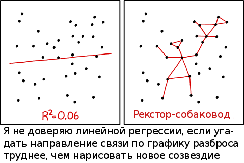
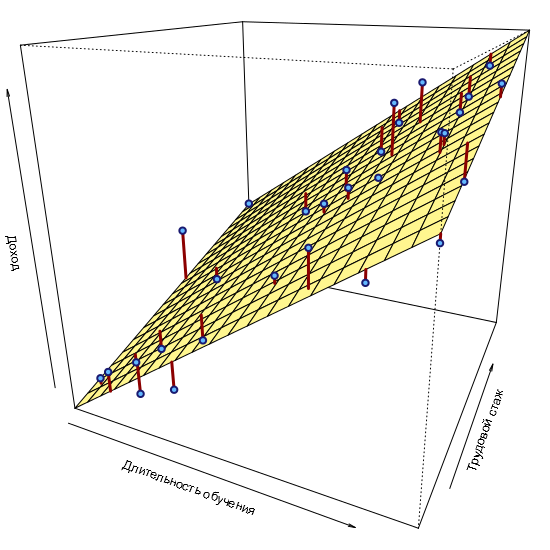
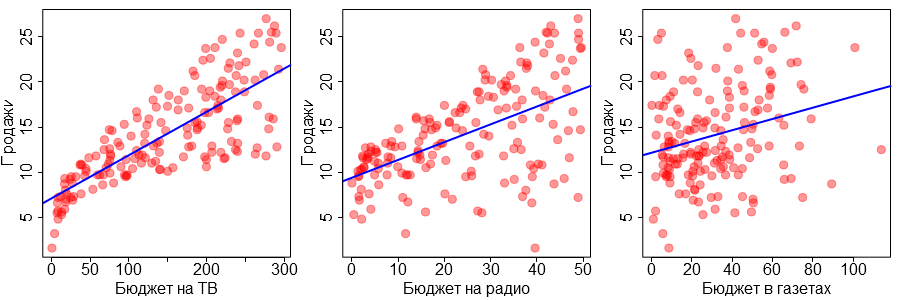
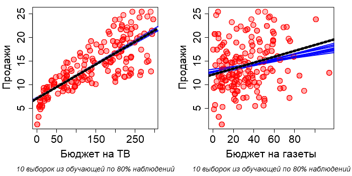
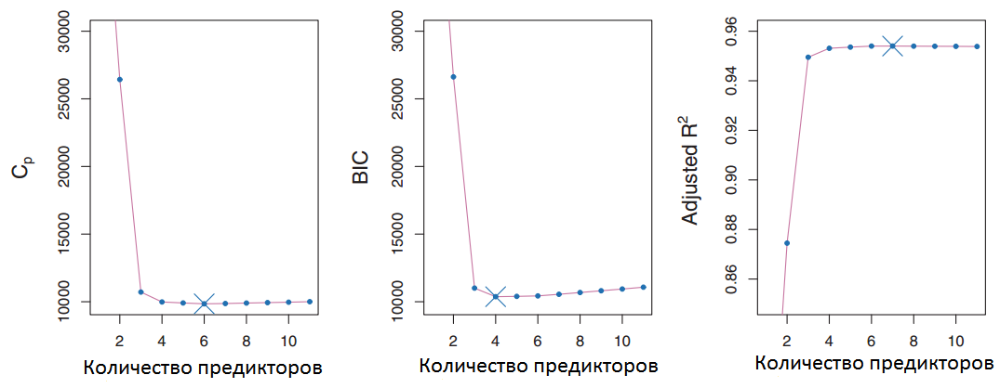
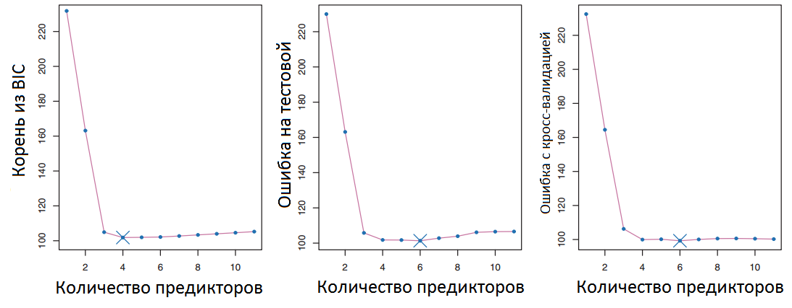

---
output:
  xaringan::moon_reader:
    css: ["./guu-slides-theme.css"]
    seal: false
    nature:
      ratio: '16:9'
      countIncrementalSlides: false
title: 'Lection-03'
---

```{r setup, include=FALSE}
options(htmltools.dir.version = FALSE, scipen = 999)

```

class: inverse, center, middle  
background-image: url(./title_GERB-GUU_16-9.png)
background-size: cover

### Методы и технологии машинного обучения

## Лекция 3:  Линейные регрессионные модели    

### Светлана Андреевна Суязова (Аксюк) </br> [sa_aksyuk@guu.ru](mailto:sa_aksyuk@guu.ru)  

осенний семестр 2021 / 2022 учебного года

```{r Подготовка рабочего пространства, include = F}
library('knitr')
library('ISLR')      # Advertising
library('lmtest')    # bptest
library('sandwich')  # vcov
library('car')       # vif()
library('FNN')       # knn.reg()
library('Cairo')
library('corrplot')
library('psych')

# Advertising data
fileURL <- 'https://raw.githubusercontent.com/nguyen-toan/ISLR/master/dataset/Advertising.csv'
Advertising <- read.csv(fileURL, row.names = 1)

# wages RF 2012 data
fileURL <- 'https://sites.google.com/a/kiber-guu.ru/msep/mag-econ/salary_data.csv?attredirects=0&d=1'
wages.ru <- read.csv(fileURL, row.names = 1, sep = ';')

my.seed <- 12345
train.percent <- 0.85

```

---

.pull-left[

# План лекции   

- Непрерывный $Y$: линейная регрессия  
--
- Качественные регрессоры, взаимодействие регрессоров
- Выбор оптимальной модели  

]

.pull-right[



<div align = "left", style = "font-family: 'Courier New'; font-size: 70%"><a href = "https://xkcd.com/1725/">xkcd.com/1725/</a></div>

]

---

**Линейная регрессия <font color = "blue">линейна по параметрам</font>**

$$Y = f(X) + \epsilon$$

$$f(X) = \hat{\beta}_0 + \sum_{j = 1}^p{X_j\hat{\beta}_j},$$

где $\hat{\beta}_0$, $\hat{\beta}_j$ – оценки параметров; $X_j$ – регрессоры:  

- непрерывные (количественные) переменные;  
- базисные функции ( $\mathrm{log{X}}$, $\sqrt{X}$, $X^2$ );  
- полиномиальные представления: $X_2 = X_1^2, X_3 = X_1^3$;  
- фиктивные переменные (<em>dummy</em>);  
- взаимодействия между переменными: $X_3 = X_1 \cdot X_2$.

---

$$\scriptsize{
RSS(\beta) = \sum_{i = 1}^n{ \Big( y_i - f(x_i) \Big) ^2} = \sum_{i = 1}^n{\Big( y_i - \beta_0 - \sum_{j = 1}^p{x_{ij}\beta_j} \Big) ^2} \rightarrow \mathrm{min}
}$$


```{r plot-01, include = F}
# данные
df.income <- read.csv('https://raw.githubusercontent.com/ranalytics/islr-ru/master/Data/Income2.csv', sep = ',', dec = '.')

# разворот и масштаб графика
.theta = 25
.phi = 20
.expand = 1

# параметрическая модель
param.model <- lm(Income ~ Education + Seniority, data = df.income)

# plot 1
Cairo(file = './plots/lection-03_plot-01.png', width = 550, height = 550)
par(mar = rep(0, 4))

x.seq <- seq(min(df.income$Education), max(df.income$Education), length = 20)
y.seq <- seq(min(df.income$Seniority), max(df.income$Seniority), length = 20)
persp(x = x.seq,
      y = y.seq,
      z = outer(x.seq, y.seq, function (a, b) predict(param.model, newdata = data.frame(Education = a, Seniority = b))),
      xlab = 'Длительность обучения', ylab = 'Трудовой стаж', zlab = 'Доход',
      col = 'khaki1',
      theta = .theta, phi = .phi, expand = .expand) -> res
obs <- trans3d(df.income$Education, 
               df.income$Seniority, 
               df.income$Income, pmat = res)
pred  <- trans3d(df.income$Education, 
               df.income$Seniority, 
               fitted(param.model), pmat = res)
segments(obs$x, obs$y, pred$x, pred$y, lwd = 3, col = 'darkred')
points(obs, bg = 'steelblue1', col = 'midnightblue', 
       pch = 21, lwd = 2)

dev.off()
```

.center[

]

---

МНК-оценки: $\hat{\beta} = (X^TX)^{-1}X^T\mathrm{y}$  

Допущения:  

- остатки случайны и соответствуют условиям Гаусса-Маркова;  
- переменные $\mathrm{x}_1,...,\mathrm{x}_j,...,\mathrm{x}_p$ некоррелированы.  

Теорема Гаусса-Маркова: МНК-оценки обладают наименьшей дисперсией в классе линейных несмещённых оценок:  

$$Var(\hat{\beta}) = (X^TX)^{-1}\hat{\sigma}^2, \, \mathrm{где} \, \hat{\sigma}^2 = \hat{Var}(\epsilon)$$  

*Однако, если пожертвовать несмещённостью, можно уменьшить дисперсию оценок параметров (LASSO, ридж-регрессия)*

---

**Пример 1 (маркетинговый план): ** <font color = "brown" font-name = "Courier New">Advertising</font>

.small[
- $n = `r dim(Advertising)[1]`$, $p = `r dim(Advertising)[2]-1`$;  
- обучающая выборка: 85%;   
- `Sales` – объём продаж продукта, тыс. единиц;  
- `TV` – размер рекламного бюджета на ТВ, тыс.долл.;  
- `Radio` – рекламный бюджет на радио;  
- `Newspaper` – рекламный бюджет в газетах. 
]

```{r plot-02, include = F}

set.seed(my.seed)
inTrain <- sample(seq_along(Advertising$Sales), nrow(Advertising) * train.percent)

Cairo('./plots/lection-03_plot-02.png', width = 900, height = 300)
par(mar = c(4.5, 4.5, 1, 1))
par(mfrow = c(1, 3))
# график 1
plot(Advertising$TV[inTrain], Advertising$Sales[inTrain], 
     pch = 21, cex = 2, cex.lab = 2, cex.axis = 2,
     xlab = 'Бюджет на ТВ', ylab = 'Продажи', 
     col = rgb(1, 0, 0, alpha = 0.4), bg = rgb(1, 0, 0, alpha = 0.4))
mod <- lm(Sales ~ TV, data = Advertising[inTrain, ])
abline(a = mod$coef[1], b = mod$coef[2], col = 'blue', lwd = 2)
# график 2
plot(Advertising$Radio[inTrain], Advertising$Sales[inTrain], 
     pch = 21, cex = 2, cex.axis = 2, cex.lab = 2,
     xlab = 'Бюджет на радио', ylab = 'Продажи', 
     col = rgb(1, 0, 0, alpha = 0.4), bg = rgb(1, 0, 0, alpha = 0.4))
mod <- lm(Sales ~ Radio, data = Advertising[inTrain, ])
abline(a = mod$coef[1], b = mod$coef[2], col = 'blue', lwd = 2)
# график 3
plot(Advertising$Newspaper[inTrain], Advertising$Sales[inTrain], 
     pch = 21, cex = 2, cex.lab = 2, cex.axis = 2,
     xlab = 'Бюджет в газетах', ylab = 'Продажи', 
     col = rgb(1, 0, 0, alpha = 0.4), bg = rgb(1, 0, 0, alpha = 0.4))
mod <- lm(Sales ~ Newspaper, data = Advertising[inTrain, ])
abline(a = mod$coef[1], b = mod$coef[2], col = 'blue', lwd = 2)
dev.off()

```

.center[

]

---

**Дисперсия оценок и устойчивость модели**

```{r plot-03, include = F}
Cairo('./plots/lection-03_plot-03.png', height = 350, width = 700)
par(mar = c(6.5, 4.5, 1, 2.5))
par(mfrow = c(1, 2))

# график 1
for (i in 1:10){
    set.seed(my.seed + i*(-1)^i)
    .sample <- sample(seq_along(Advertising$Sales[inTrain]), 
                      nrow(Advertising) * train.percent * 0.8)
    mod <- lm(Sales ~ TV, data = Advertising[.sample, ])
    if (i == 1) {
        plot(Advertising$TV[.sample], Advertising$Sales[.sample], 
             pch = 21, cex = 1.7, cex.lab = 1.7, cex.axis = 1.7,
             xlab = 'Бюджет на ТВ', ylab = 'Продажи',
             col = rgb(1, 0, 0, alpha = 0.4), bg = rgb(1, 0, 0, alpha = 0.05))
    } else {
        points(Advertising$TV[.sample], Advertising$Sales[.sample], 
             pch = 21, cex = 1.7, cex.lab = 1.7,
             col = rgb(1, 0, 0, alpha = 0.4), bg = rgb(1, 0, 0, alpha = 0.05))
    }
    abline(a = mod$coef[1], b = mod$coef[2], col = 'blue', lwd = 2)
}
mod <- lm(Sales ~ TV, data = Advertising[inTrain, ])
abline(a = mod$coef[1], b = mod$coef[2], col = 'white', lwd = 5)
abline(a = mod$coef[1], b = mod$coef[2], col = 'black', lwd = 5, lty = 2)
mtext('10 выборок из обучающей по 80% наблюдений', font = 3,
      side = 1, line = 5, cex = 1.1)

# график 2
for (i in 1:10){
    set.seed(my.seed + i*(-1)^i)
    .sample <- sample(seq_along(Advertising$Sales[inTrain]), 
                      nrow(Advertising) * train.percent * 0.8)
    mod <- lm(Sales ~ Newspaper, data = Advertising[.sample, ])
    if (i == 1) {
        plot(Advertising$Newspaper[.sample], Advertising$Sales[.sample], 
             pch = 21, cex = 1.7, cex.lab = 1.7, cex.axis = 1.7, 
             xlab = 'Бюджет на газеты', ylab = 'Продажи',
             col = rgb(1, 0, 0, alpha = 0.4), bg = rgb(1, 0, 0, alpha = 0.05))
    } else {
        points(Advertising$Newspaper[.sample], Advertising$Sales[.sample], 
             pch = 21, cex = 1.7, cex.lab = 1.7,
             col = rgb(1, 0, 0, alpha = 0.4), bg = rgb(1, 0, 0, alpha = 0.05))
    }
    abline(a = mod$coef[1], b = mod$coef[2], col = 'blue', lwd = 2)
}
mod <- lm(Sales ~ Newspaper, data = Advertising[inTrain, ])
abline(a = mod$coef[1], b = mod$coef[2], col = 'white', lwd = 5)
abline(a = mod$coef[1], b = mod$coef[2], col = 'black', lwd = 5, lty = 2)
mtext('10 выборок из обучающей по 80% наблюдений', font = 3,
      side = 1, line = 5, cex = 1.1)

dev.off()
```

.center[

]

.small[
```{r echo = F}
tbl <- data.frame(Модель = c('для ТВ (n=170)', 'для газет (n=170)'),
                  Оценка.коэфф.b_1 = rep(0, 2), 
                  Ошибка.коэфф.b_1 = rep(0, 2))
model.1 <- lm(Sales ~ TV, data = Advertising[inTrain, ])
tbl[1, 2:3] <- summary(model.1)$coefficients[2, 1:2]
model.2 <- lm(Sales ~ Newspaper, data = Advertising[inTrain, ])
tbl[2, 2:3] <- summary(model.2)$coefficients[2, 1:2]
tbl[, 2] <- round(tbl[, 2], 3)
tbl[, 3] <- round(tbl[, 3], 4)

kable(tbl, row.names = F)

```
]

---

## Два подхода к отбору объясняющих переменных   

1. Эконометрический: на основе проверки гипотез. Ключевые метрики – P-значения для параметров, скорректированный R-квадрат, информационные критерии качества (Акаике, Байесовский и т.д.).      

1. Машинного обучения: на основе точности модели (MSE на тестовой выборке), методов сжатия и снижения размерности.   

---

# План лекции   

- Непрерывный $Y$: линейная регрессия  
- Качественные регрессоры, взаимодействие регрессоров  
--  
- Выбор оптимальной модели  

---

## Пример интерпретации модели с качественными регрессорами

**Пример 2 (зарплаты, Москва, 2012): **<font color = "brown" font-name = "Courier New">wages.ru</font>

*Цель*: построить модель, чтобы обосновать влияние различных факторов на размер среднемесячной заработной платы. </br></br>
*Данные*: Подвыборка данных по 150 жителям Москвы из репрезентативной выборки по индивидуумам 21-ой волны обследования (2012г.) «Российского мониторинга экономического положения и здоровья населения НИУ-ВШЭ (RLMS-HSE)» (<http://www.hse.ru/rlms'>http://www.hse.ru/rlms>).

---

**Пример 2 (зарплаты, Москва, 2012): **<font color = "brown" font-name = "Courier New">wages.ru</font>

- `salary` – среднемесячная зарплата после вычета налогов за последние 12 месяцев (рублей);  
- `male` – пол: **1** – мужчина, **0** – женщина;
- `educ` – уровень образования:

.small[
- **1** – 0-6 классов,   
- **2** – незаконченное среднее (7-8 классов),  
- **3** - незаконченное среднее плюс что-то еще,  
- **4** – законченное среднее,  
- **5** – законченное среднее специальное,  
- **6** – законченное высшее образование и выше;  
]
- `forlang` - иност. язык: **1** – владеет, **0** – нет;
- `exper` – официальный стаж с 1.01.2002 (лет).

---

### Модель 1: $\hat{\mathrm{salary}} = \hat{\beta}_0 + \hat{\beta}_1 \cdot \mathrm{male}$  

```{r, include = F}
set.seed(my.seed)
inTrain <- sample(seq_along(wages.ru$salary), nrow(wages.ru) * train.percent)
df.wage.train <- wages.ru[inTrain, ]
df.wage.test <- wages.ru[-inTrain, ]

model.1 <- lm(salary ~ male, data = df.wage.train)

```

.small[
```{r, echo = F}
tbl <- as.data.frame(summary(model.1)$coefficients)
tbl[, 1] <- round(tbl[, 1], 0)
tbl[, 2] <- round(tbl[, 2], 2)
tbl[, 3] <- round(tbl[, 3], 2)
tbl[, 4] <- round(tbl[, 4], 4)

kable(tbl)

```
]

$\mathrm{male} = 0$: $\hat{\mathrm{salary}} = `r tbl[1, 1]` + `r tbl[2, 1]` \cdot 0 = `r tbl[1, 1] + tbl[2, 1] * 0`$   
   
$\mathrm{male} = 1$: $\hat{\mathrm{salary}} = `r tbl[1, 1]` + `r tbl[2, 1]` \cdot 1 = `r tbl[1, 1] + tbl[2, 1] * 1`$  

---

### Модель 2: $\hat{\mathrm{salary}} = \hat{\beta}_0 + \hat{\beta}_1 \cdot \mathrm{exper} + \hat{\beta}_2 \cdot \mathrm{male}$     

```{r, include = F}
model.2 <- lm(salary ~ exper + male, data = wages.ru[inTrain, ])

```

.small[
```{r, echo = F}
tbl <- as.data.frame(summary(model.2)$coefficients)
tbl[, 1] <- round(tbl[, 1], 0)
tbl[, 2] <- round(tbl[, 2], 2)
tbl[, 3] <- round(tbl[, 3], 2)
tbl[, 4] <- round(tbl[, 4], 4)

kable(tbl)

```
]

$\mathrm{male} = 0$: $\hat{\mathrm{salary}} = `r tbl[1, 1]` + `r tbl[2, 1]` \cdot \mathrm{exper}$   
   
$\mathrm{male} = 1$: $\hat{\mathrm{salary}} = `r tbl[1, 1]` + `r tbl[2, 1]` \cdot \mathrm{exper} + `r tbl[3, 1]` = `r tbl[1, 1] + tbl[3, 1]` + `r tbl[2, 1]` \cdot \mathrm{exper}$

---

### Модель 3: $\hat{\mathrm{salary}} = \hat{\beta}_0 + \hat{\beta}_1 \cdot \mathrm{exper} + \hat{\beta}_2 \cdot \mathrm{male} + \hat{\beta}_3 \cdot \mathrm{male} \cdot \mathrm{exper}$   

```{r, include = F}
model.3 <- lm(salary ~ exper * male, data = wages.ru[inTrain, ])

```

.small[
```{r, echo = F}
tbl <- as.data.frame(summary(model.3)$coefficients)
tbl[, 1] <- round(tbl[, 1], 0)
tbl[, 2] <- round(tbl[, 2], 2)
tbl[, 3] <- round(tbl[, 3], 2)
tbl[, 4] <- round(tbl[, 4], 4)

kable(tbl)

```
]

.small[
Коэффициенты модели **незначимы**; эффект взаимодействия `exper:male` наименее значим.  

```{r, echo = F}

MSE.test <- c(0, 0, 0)
pred <- predict(model.1, newdata = wages.ru[-inTrain, ])
MSE.test[1] <- (sum(wages.ru$salary[-inTrain] - pred)^2) / nrow(wages.ru[-inTrain, ])
pred <- predict(model.2, newdata = wages.ru[-inTrain, ])
MSE.test[2] <- (sum(wages.ru$salary[-inTrain] - pred)^2) / nrow(wages.ru[-inTrain, ])
pred <- predict(model.3, newdata = wages.ru[-inTrain, ])
MSE.test[3] <- (sum(wages.ru$salary[-inTrain] - pred)^2) / nrow(wages.ru[-inTrain, ])

tbl.2 <- data.frame(Модель = c(1, 2, 3), 
                          R.квадрат = c(round(summary(model.1)$r.sq, 3),
                                        round(summary(model.2)$r.sq, 3),
                                        round(summary(model.3)$r.sq, 3)),
 R.квадрат.скорр = c(round(summary(model.1)$adj.r.squared, 3),
                     round(summary(model.2)$adj.r.squared, 3),
                     round(summary(model.3)$adj.r.squared, 3)),
 F.расч = c(round(summary(model.1)$f[1], 3),
                     round(summary(model.2)$f[1], 3),
                     round(summary(model.3)$f[1], 3)),
 MSE.тест = formatC(MSE.test, digits = 2, format = 'e'))

kable(tbl.2)

```
]

---

# План лекции   

- Непрерывный $Y$: линейная регрессия  
- Качественные регрессоры, взаимодействие регрессоров  
- Выбор оптимальной модели  
--  

---

### Первый подход: измерители точности <font color = "blue">с поправкой</font>  

.small[
$C_p$ – оценка среднеквадратичной ошибки на контрольной выборке:    

$$C_p = {1 \over n} \bigg( RSS + 2 d \color{blue} {\hat{\sigma}^2} \bigg)$$

где <font color = "blue"> $\hat{\sigma}^2$ </font> – оценка дисперсии остатков $\epsilon$ для всех уникальных значений отклика регрессионной модели, $d$ – количество предикторов, $RSS$ – остаточная сумма квадратов регрессионной модели.  

$AIC$ – информационный критерий Акаике:  

$$AIC = {1 \over n \color{blue} {\hat{\sigma}^2}} \bigg( RSS + 2 d \color{blue} {\hat{\sigma}^2} \bigg)$$

*В формуле опущена константа.* 
]

---

### Первый подход: измерители точности <font color = "blue">с поправкой</font>  

.small[
$BIC$ – байсовский информационный критерий:  

$$BIC = {1 \over n} \bigg( RSS + \mathrm{log}(n) d \color{blue} {\hat{\sigma}^2} \bigg)$$
*В формуле опущена константа.*

$R^2_{adj}$ – скорректированный коэффициент детерминации:  

$$R^2_{adj} = 1 - {RSS / (n - d - 1) \over TSS / (n - 1)}$$

При увеличении количества предикторов $R^2$ всегда растёт, а $R^2_{adj}$ может как расти, так и снижаться.  
]

---

```{r, include = F}
# # проблема с полями графика, построили и сохранили вручную
# Cairo('./plots/lection-03_plot-04.png', width = 650, height = 650)
# par(mar = c(0, 0, 0, 0), oma = c(0, 0, 0, 0))
# df <- as.data.frame(model.matrix(Balance ~ ., data = Credit[, -1]))[ , -1]
# df <- cbind(df, Balance = Credit$Balance)
# M <- mixedCor(df, c = c('Income', 'Limit', 'Rating', 'Cards', 
#                         'Age', 'Education', 'Education', 'Balance'), 
#               d = c('GenderFemale', 'StudentYes', 'MarriedYes',
#                     'EthnicityAsian', 'EthnicityCaucasian'))
# corrplot(M$rho, method = 'square', type = 'upper', diag = FALSE,
#          mar = c(0, 0, 0, 0), oma = c(0, 0, 0, 0))
# dev.off()

```

.center[

]

.small[
*Данные <font face = "Courier New", color = "brown">Credit</font>*
]

---

**Измерители точности <font color = "blue">с поправкой</font>**   

.center[

]

.small[
Данные <font face = "Courier New", color = "brown">Credit</font>  
Компромисс по минимумам $C_p$, $AIC$, максимуму $R^2_{adj}$ и *простоте модели*: **4 объясняющих**  
]

---

**Второй подход: оценка ошибки <font color = "blue">непосредственно на проверочных данных</font>**    

.center[

]

.small[
Данные <font face = "Courier New", color = "brown">Credit</font>  
*Правило одной стандартной ошибки*: (а) оценить стандартную ошибку оценок MSE ( $\hat{\sigma}_{MSE}$ ); (б) выбрать модель в пределах $\pm \hat{\sigma}_{MSE}$ от $MSE_\mathrm{min}$  
]

---

.small[

**Источники**

1. *Джеймс Г.*, *Уиттон Д.*, *Хасти Т.*, *Тибширани Р.* Введение в статистическое обучение с примерами на языке R. Пер. с англ. С.Э. Мастицкого – М.: ДМК Пресс, <b>2016</b> – 450 с.  

1. Данные `Advertising` (<http://www-bcf.usc.edu/~gareth/ISL/Advertising.csv>).   

1. Данные `wage.ru` (<https://sites.google.com/a/kiber-guu.ru/msep/mag-econ/salary_data.csv?attredirects=0&d=1>).   

1. Данные `Credit` (<https://rdrr.io/cran/ISLR/man/Credit.html>).   

]
