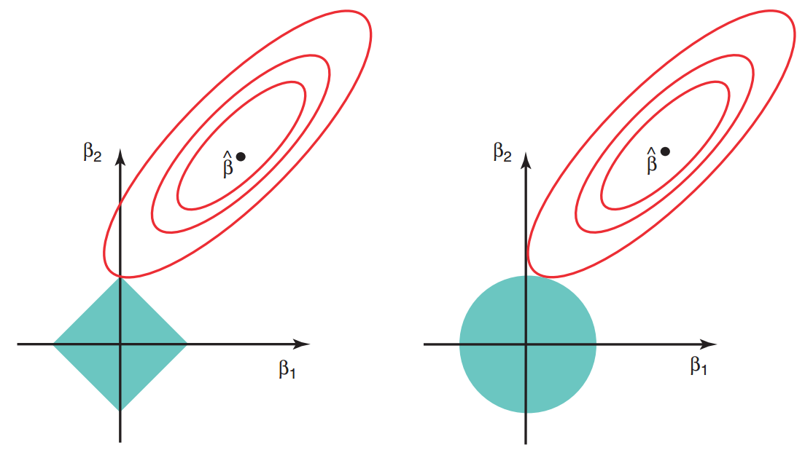

---
output:
  xaringan::moon_reader:
    css: ["./guu-slides-theme.css"]
    seal: false
    nature:
      ratio: '16:9'
      countIncrementalSlides: false
title: 'Lection-03'
---

```{r setup, include=FALSE}
options(htmltools.dir.version = FALSE, scipen = 999)

```

class: inverse, center, middle  
background-image: url(./title_GERB-GUU_16-9.png)
background-size: cover

### Методы и технологии машинного обучения

## Лекция 4: Регуляризация линейной регрессии. Методы сжатия. Методы снижения размерности.  

### Светлана Андреевна Суязова (Аксюк) </br> [sa_aksyuk@guu.ru](mailto:sa_aksyuk@guu.ru)  

осенний семестр 2021 / 2022 учебного года

```{r Подготовка рабочего пространства, include = F}
library('knitr')
library('ISLR')
library('GGally')
library('Cairo')

my.seed <- 12345
train.percent <- 0.85

if (!dir.exists('plots')) {
  dir.create('./plots/')
}

```

---

.pull-left[

# План лекции   

- Методы сжатия  
--  
- Методы снижения размерности  
- Особенности работы с данными большой размерности  

]

.pull-right[


]

---

## Альтернативы МНК  

$$
Y = \beta_0 + \beta_1 X_1 + ... + \beta_p X_p + \epsilon
$$

**Преимущества МНК:**  проверка гипотез и статистический вывод  

**Зачем искать альтернативы МНК?**  
- снизить дисперсию оценок (признак переобучения)  
- обойти проблему оценивания параметров при большой размерности, когда $p > n$  
- повысить точность предсказаний, снизить ошибку вне выборки  
- автоматически отсеивать несущественные признаки из состава объясняющих переменных  

---

**Что если объясняющих переменных очень много?**    

.small[
- **отбор подмножества переменных** – уменьшение набора объясняющих переменных, затем применение МНК     
- **сжатие оценок параметров** – подгонка модели на всех $p$ предикторах, с ограничениями на значения коэффициентов модели   
- **снижение размерности пространства объясняющих переменных** – проецирование пространства $p$ предикторов на $M$-мерное пространство, $M < p$   
]

.center[

]

---

### Алгоритм **последовательного обратного отбора** признаков (SBS) 

.small[
1. $M_p$ – модель с $k = p$ признаками, где $p$ – их общее количество.   
2. Определить признак $\bar{x}$, который максимизирует критерий $\bar{x} = \mathrm{argmax} J(X_k - x)$:    
  (а) построить $k$ моделей, в каждой исключив по одному признаку,   
  (б) оценить качество моделей,  
  (в) оценить функцию потери качества $J$, найти её максимум и соответствующий признак.  
3. Удалить $\bar{x}$ из пространства признаков. $X_{k-1} = X_k - \bar{x}$, $k-=1$.  
4. Если $k$ достиг требуемого числа признаков, остановиться, иначе перейти на шаг 2.  

*Недостатки*:  
- SBS – "жадный" алгоритм, т.е. на каждом шаге он находит локальный оптимум   
- можно пропустить оптимальное сочетание признаков   
- большой объём вычислений при высоком значении $p$  

*Ещё варианты*: последовательное включение признаков, отбор оптимального подмножества (самый ресурсоёмкий)    
]

---

## Методы сжатия 

Цели:  
- сохранить интерпретируемость 
- снизить дисперсию оценок параметров  
- оценивать параметры в задачах большой размерности    
- избежать потерь спецификаций, связанных с методами отбора предикторов  

Решение:  
- Гребневая регрессия (ридж-регрессия)  
- Лассо-регрессия  

---

## Гребневая регрессия  

Минимизация суммы квадратов отклонений со штрафной функцией:  

$$\sum_{i = 1}^n \Bigg( y_i - \beta_0 - \sum_{j = 1}^p{\beta_j x_{ij}} \Bigg)^2 + \lambda \sum_{j = 1}^p{\beta_j^2} = \\ = RSS + \lambda \sum_{j = 1}^p{\beta_j^2} \rightarrow \mathrm{min}$$

где $\lambda \ge 0$ – гиперпараметр, который подбирают путём сравнения моделей по точности.    

---

### Гребневая регрессия  

.center[

]

.small[
Данные <font face = "Courier New", color = "brown">Credit</font>. $||\beta||_2 = \sqrt{\sum_{j = 1}^p{\beta_j^2}}$ – эль-два норма $\beta$, или расстояние от $\beta$ до нуля  
]

---

## Лассо  

Минимизация суммы квадратов отклонений со штрафной функцией:  

$$\sum_{i = 1}^n \Bigg( y_i - \beta_0 - \sum_{j = 1}^p{\beta_j x_{ij}} \Bigg)^2 + \lambda \sum_{j = 1}^p{|\beta_j|} = \\ = RSS + \lambda \sum_{j = 1}^p{|\beta_j|} \rightarrow \mathrm{min}$$

где $\lambda \ge 0$ – гиперпараметр.    

---

## Лассо  

.center[

]

.small[
Данные <font face = "Courier New", color = "brown">Credit</font>. $||\beta||_1 = {\sum_{j = 1}^p|\beta_j|}$ – эль-один норма $\beta$  
]

---

### Контурные диаграммы RSS в лассо и ридж  

.left-column[
.small[
Сгенерированные данные, $p = 2$.  
  
Слева: ограничения на коэффициенты в лассо   
  
Справа: ограничения на коэффициенты в ридж  
]
]

.right-column[
.center[

]
]

---

## Методы сжатия  

- уменьшают дисперсию оценок коэффициентов моделей 
- увеличивают смещение оценок коэффициентов 
- в целом, улучшают модель, сохраняя интерпретируемость  
- лассо может ещё и выбрасывать предикторы, приравнивая значения коэффициентов к нулю  
- необходима предварительная стандартизация всех переменных  

---

# План лекции   

- Методы сжатия  
- Методы снижения размерности  
--  
- Особенности работы с данными большой размерности  

---

## Методы снижения размерности  

Принцип: **сначала преобразовать пространство предикторов, потом строить модель**  
Подбираем линейную комбинацию предикторов:  

$$Z_m = \sum_{j = 1}^p{\phi_{jm} X_j}$$

Строим модель на преобразованных объясняющих переменных:   

$$y_i = \theta_0 + \sum_{m = 1}^M{\theta_m z_m} + \epsilon_i; \, \, i = 1,...,n$$

---

## Методы снижения размерности 

Рассмотрим методы подбора констант $\phi_{jm}$:  
- метод регрессии на главные компоненты (PCR)    
- метод частных наименьших квадратов (PLS)  

Принцип преобразования пространства $X$ в $Z$ – найти направления, в которых разброс точек в пространстве предикторов наибольший. При этом:    
- PCR – "обучение без учителя", найденные направления не зависят от $Y$  
- PLS – "обучение с учителем", при поиске направлений учитывается корреляция с $Y$

---

### Регрессия на главные компоненты   

.left-column[
.small[
Данные по рекламе в 100 городах    
  
Зелёная сплошная линия: первая ГК  
Синяя прерывистая линия: вторая ГК  
]
]

.right-column[
.center[

]
]

---

### Регрессия на главные компоненты   

.small[
1. Стандартизировать исходный набор данных $X$ и вектор значений зависимой переменной $Y$  

1. Построить ковариационную матрицу $cov(X)$ 

1. Разложить ковариационную матрицу на её собственные векторы и собственные значения   

1. Выбрать $k$ собственных векторов, которые соответствуют $k$ наибольшим собственным значениям ( $k \le p$ )  

1. Создать проекционную матрицу $W$ из "верхних" $k$ собственных векторов  

1. Преобразовать $p$-мерный набор данных $X$, используя $W$, и получить $k$-мерное пространство признаков: $X^\prime = XW$   
]

---

### Регрессия на главные компоненты   

.left-column[
.small[
Данные <font face = "Courier New", color = "brown">Credit</font>  
  
Слева: изменение коэффициентов модели при увеличении количества компонент  
  
Справа: чем больше компонент, тем ниже ошибка модели
]
]

.right-column[
.center[

]
]

---

### Метод частных наименьших квадратов  

.left-column[
.small[
Данные по рекламе в 100 городах    
  
Зелёная сплошная линия: первая ГК  
Синяя прерывистая линия: вторая ГК  
]
]

.right-column[
.center[

]
]

---

### Метод частных наименьших квадратов   

.small[
1. Стандартизировать исходный набор данных $X$ и вектор значений зависимой переменной $Y$     

1. Оценить корреляционную связь между $\mathrm{x_j}$ и $Y$ ( $\forall j$ )   

1. Осуществить сингулярное разложение матрицы $X^T Y$ и сформировать вектор $W$ первого направления PLS, в который с наибольшим весом входят переменные, теснее всего связанные с откликом $Y$    

1. Спроецировать исходные переменные $X$ на ось, расположенную в направлении вектора $W$, рассчитать матрицу компонент и матрицу нагрузок.  

1. Второе и последующие направления PLS вычислять аналогично предыдущим шагам, причём каждый раз на остатках модели  
]

---

# План лекции 

- Методы сжатия  
- Методы снижения размерности  
- Особенности работы с данными большой размерности  
--  

---

## Данные большой размерности   

.center[

]

---

**Данные большой размерности: $p \ge n$** 

.center[

]

.small[
Три имитированных набора данных с $n_{train} = 100$ и разными $p$  
Из всех предикторов только 20 связаны с $Y$  
Построены модели лассо, по горизонтали – количество ненулевых коэффициентов модели для трёх различных значений $\lambda$, по вертикали – разброс $MSE_{test}$  
]

---

.center[

]

.small[
Имитированный набор данных с $n = 20$  
**Добавляем в модель переменные, не связанные с $Y$**  
* по $R^2$ качество модели растёт;    
* по MSE на обучающей выборке качество растёт;    
* $MSE_{ТЕСТ}$ показывает ухудшение качества модели. 
]

---

.small[

**Источники**

1. *Джеймс Г.*, *Уиттон Д.*, *Хасти Т.*, *Тибширани Р.* Введение в статистическое обучение с примерами на языке R. Пер. с англ. С.Э. Мастицкого – М.: ДМК Пресс, <b>2016</b> – 450 с.  

1. Рашка С. Python и машинное обучение: крайне необходимое пособие по новейшей предсказательной аналитике, обязательное для более глубокого понимания методологии машинного обучения / пер. с англ. А.В. Логунова. – М.: ДМК Пресс, 2017. – 418 с.: ил.  

1. Шитиков В. К., Мастицкий С. Э. (2017) Классификация, регрессия, алгоритмы Data Mining с использованием R. - Электронная книга, адрес доступа: <https://github.com/ranalytics/data-mining>  

1. Данные `Advertising` (<http://www-bcf.usc.edu/~gareth/ISL/Advertising.csv>).  
1. Данные `Credit` (<https://rdrr.io/cran/ISLR/man/Credit.html>).   

]
