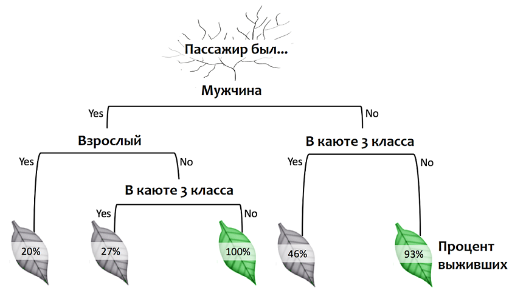
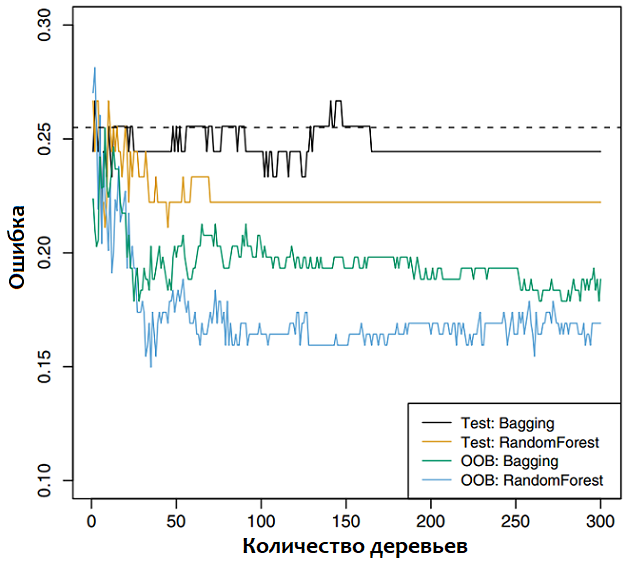

---
output:
  xaringan::moon_reader:
    css: ["./guu-slides-theme.css"]
    seal: false
    nature:
      ratio: '16:9'
      countIncrementalSlides: false
title: 'Lection-03'
---

```{r setup, include=FALSE}
options(htmltools.dir.version = FALSE, scipen = 999)

```

class: inverse, center, middle  
background-image: url(./title_GERB-GUU_16-9.png)
background-size: cover

### Методы и технологии машинного обучения

## Лекция 5: Методы, основанные на деревьях решений  

### Светлана Андреевна Суязова (Аксюк) </br> [sa_aksyuk@guu.ru](mailto:sa_aksyuk@guu.ru)  

осенний семестр 2021 / 2022 учебного года

```{r Подготовка рабочего пространства, include = F}
library('knitr')

my.seed <- 12345
train.percent <- 0.85

```

---

.pull-left[

# План лекции   

- Деревья решений  
-- 
- Что такое бутстреп   
- Бэггинг, случайный лес, бустинг   

]

.pull-right[


<div align = "left", style = "font-family: 'Courier New'; font-size: 70%"><a href = "https://www.instagram.com/harolds.planet/">instagram.com/harolds.planet/</a></div>

]

---

.center[

]

.small[
Пример на данных <font face = "Courier New", color = "brown">Titanic</font>.
]

---

.center[

]

.small[
- Дерево сегментирует пространство $X$-ов на несколько ограниченных областей  
- Деревья применяются в задачах регрессии и классификации  
- Предсказание делают по оценке среднего (среднее, медиана, мода) для сегмента, в котором оказалось наблюдение   
- Проверка гипотез о характере взаимосвязей между откликом и объясняющими переменными невозможна  
]

---

**Дерево решений в задаче регрессии**  

.center[

]

.small[
Пример на данных <font face = "Courier New", color = "brown">Hitters</font>, отклик: `log(`<font face = "Courier New", color = "brown">Salary</font>`)`.
]

---

**Дерево решений в задаче регрессии**  

.left-column[
.small[

$$ \begin{split} R_1 = & \\{ X | Years < 4.5 \\} \\\ R_2 = & \\{ X | Years > 4.5, \\\ & Hits < 117.5 \\} \\\ R_3 = & \\{ X | Years > 4.5,\\\ & Hits > 117.5 \\} \end{split} $$

Прогнозы:  
$$
\begin{split}
& \hat{y}_{R_1} = 1000 \cdot \exp^{5.11} \approx 165670\$  \\ 
& \hat{y}_{R_2} = 1000 \cdot \exp^{6} \approx 403429\$  \\ 
& \hat{y}_{R_3} = 1000 \cdot \exp^{6.74} \approx 845561\$  \\ 
\end{split}
$$

Конечные узлы (листья): $R_1, R_2, R_3$  
]
]

.right-column[
.right[

]
]

---

## Интерпретация  

`|---` **`Years < 4.50`**   
`|`<font face = "Courier New", color = "white">---</font>`|--- log_Salary: 5.11`   
`|---` **`Years >= 4.50`**   
`|`<font face = "Courier New", color = "white">---</font>`|---` **`Hits < 117.5`**   
`|`<font face = "Courier New", color = "white">---</font>`|`<font face = "Courier New", color = "white">---</font>`|--- log_Salary: 6.00`   
`|`<font face = "Courier New", color = "white">---</font>`|---` **`Hits >= 117.5`**   
`|`<font face = "Courier New", color = "white">---</font>`|`<font face = "Courier New", color = "white">---</font>`|--- log_Salary: 6.74`   

- <font face = "Courier New", color = "brown">Years</font> – главный фактор: <font face = "Courier New", color = "brown">Years</font> $\uparrow \uparrow$ <font face = "Courier New", color = "brown">Salary</font>  

- Для игроков с высоким <font face = "Courier New", color = "brown">Years</font>. <font face = "Courier New", color = "brown">Hits</font> $\uparrow \uparrow$ <font face = "Courier New", color = "brown">Salary</font>  

---

## Процедура построения  

(1) Разбить пространство предикторов на $J$ отдельных непересекающихся многомерных прямоугольников (<em>контейнеров</em>) $R_1, R_2,...,R_J$, которые минимизируют RSS:  

$$\sum_{j = 1}^J \sum_{i \in R_j} \bigg ( y_i - \hat{y}_{R_j} \bigg) ^ 2 \rightarrow \mathrm{min}$$

(2) Для всех наблюдений, попадающих в область $R_J$, сделать одинаковое предсказание по среднему отклику у обучающих наблюдений в этой области.  

---

**Нисходящий жадный алгоритм**  
(или *рекурсивное бинарное разбиение*)

- **нисходящий**: начинается с корневого узла дерева (все наблюдения в одной области)  
  
- **жадный**: на каждом этапе выполняется разбиение, оптимальное для этого этапа, без заглядывания вперёд  

Пусть $j$ – номер предиктора, $s$ – точка разрыва:  

$$\forall j, s: \, \, \, R_1(j, s) = \{ X | X_j < s\}, \, \, \, R_2(j, s) = \{ X | X_j \ge s\}$$

$$\sum_{i: x_i \in R_1 (j, s)} \big ( y_i - \hat{y}_{R_1} \big )^2 + \sum_{i: x_i \in R_2 (j, s)} \big ( y_i - \hat{y}_{R_2} \big )^2 \rightarrow \mathrm{min}$$
---

**Пример разбиения**

.pull-left[
.center[
  

.red[*так нисходящим жадным алгоритмом разбить нельзя...*]
]
]

.pull-right[
.center[
  

.green[*...а так можно*]
]
]

---

**Пример разбиения (задача регрессии)**

.pull-left[
.center[
  

*пример рекурсивного бинарного разбиения*]
]

.pull-right[
.center[
  

*поверхность прогноза*
]
]

---


## Деревья и линейные модели   

Модель линейной регрессии:  

$$f(X) = \beta_0 + \sum_{j = 1}^p X_j \beta_j$$

Модель регрессионного дерева:  

$$f(X) = \sum_{m = 1}^M c_m \cdot 1_{(X \in R_m)}$$

.small[
где $R_1,...,R_M$ – непересекающиеся области пространства предикторов.  
]

---

.center[

]

Истинная классифицирующая функция линейна, модель регрессии (слева) работает лучше дерева (справа).  

---

.center[

]

Истинная классифицирующая функция нелинейна, регрессионное дерево (справа) лучше регрессии (слева).  

---

## Обрезка ветвей дерева  

- устранить переобучение  

- снизить число ветвей, чтобы повысить интерпретируемость дерева   

- с учётом штрафа на сложность:  

$$\sum_{m = 1}^{|T|} \sum_{i: x_i \in R_m} \big ( y_i - \hat{y}_{R_m} \big) ^2 + \alpha |T| \rightarrow \mathrm{min}$$
.small[
где $|T|$ – число конечных узлов дерева $T$, $R_m$ – контейнер, соответствующий $m$-му конечному узлу, $\hat{y}_{R_m}$ – предсказанный отклик в области $R_m$, $\alpha$ – гиперпараметр   
]

---

**Деревья классификации**  

Прогноз по наиболее часто встречающемуся классу.   
Оценки точности:

- частота ошибок классификации $E = 1 - \max\limits_k (\hat{p}_{mk})$  

- индекс Джинни $G = \sum_{k = 1}^K \hat{p}_{mk} ( 1 - \hat{p}_{mk})$  

- коэффициент перекрёстной энтропии $D = - \sum_{k = 1} ^ K \hat{p}_{mk} \log \hat{p}_{mk}$

.small[
где $\hat{p}_{mk}$ – доля обучающих наблюдений в $m$-ой области, принадлежащих классу $k$.   
При низких значениях $G$, $D$ частоты $\hat{p}_{mk}$ близки к 0 и 1, т.е. узлы "чистые".  
]

---

.center[
  
]

.small[
Данные <font face = "Courier New", color = "brown">Heart</font>, необрезанное дерево. Узлы с одинаковым прогнозом различаются частотой верно классифицированных наблюдений.  
]

---

.center[

]

.small[
Данные <font face = "Courier New", color = "brown">Heart</font>. *Слева:* ошибки в зависимости от числа узлов у обрезанного дерева. *Справа:* дерево с наименьшей ошибкой перекрёстной проверки.   
]

---

## Алгоритмы построения деревьев решений  

- [ID3](https://wiki.loginom.ru/articles/algorithm-id3.html?_ga=2.115150799.956137829.1618386565-1751203076.1618386565) – рекурсивное бинарное разбиение, максимизирует прирост информации ( $IG$ ) и минимизирует энтропию ( $H$ )   
- [С4.5](https://loginom.ru/blog/decision-tree-c45-1) – усовершенствованная версия алгоритма ID3   
- [CART](https://wiki.loginom.ru/articles/cart-algorithm.html) (Classification and Regression Tree) – алгоритм построения деревьев классификации и регрессии, строит бинарные деревья, минимизируя индекс Джини ( $G$ )  
- [CHAID](https://www.statisticssolutions.com/non-parametric-analysis-chaid/#:~:text=Chi%2Dsquare%20Automatic%20Interaction%20Detector,in%20the%20given%20dependent%20variable.) (Chi-square automatic interaction detection) – автоматическое рекурсивное бинарное разбиение на базе критерия Хи-квадрат  

---

**Преимущества деревьв решений**  

.small[
- Принцип работы модели интуитивно понятен   

- Деревья решения близки к процессу принятия решений людьми  

- Деревья можно представить графически при любой размерности пространства предикторов  

- Легко справляются с качественными предикторами, специальные фиктивные переменные на базе категориальных не нужны   
]

**Недостатки**

.small[
- Нестабильность: небольшие изменения входных данных могут сильно повлиять на модель  

- Неточность: наилучшее бинарное разбиение в корне дерева не всегда ведёт к точному прогнозу   
]

---

.pull-left[
# План лекции   

- Деревья решений  
- Что такое бутстреп   
--  
- Бэггинг, случайный лес, бустинг   
]

.pull-right[
.center[

]
]

---

**Происхождение термина "Bootstrap":**

- *1870* – петля на задней части мужского сапога, потянув за которую, можно надеть сапоги  
  
- *1900* – фигура речи "вытягивать себя за петли от сапог" означает выполнение невыполнимого задания  

- *1916* – расширение значения идиомы до "совершенствоваться в скрупулезной самостоятельной работе"  

- *1953* – последовательность инструкций для загрузки операционной системы компьютера (программа "вытягивает саму себя")    

.small[
[www.thefreedictionary.com](https://www.thefreedictionary.com); [www.etymonline.com](http://www.etymonline.com/index.php?term=bootstrap&allowed_in_frame=0)
]

---

**Использование термина "Бутстреп":**

- *В программировании:* метод создания компилятора языка программирования, при котором значительная часть кода компилятора создаётся на целевом языке   

- *В веб-разработке:* так называется инструмент веб-дизайна, фронт-энд среда разработки, распространяемая по свободной лицензии   

- **В статистике:** метод определения статистик вероятностных распределений, основанный на многократной генерации псевдовыборок методом Монте-Карло на основе имеющейся выборки   

[ru.wikipedia.org](https://ru.wikipedia.org/wiki/%D0%91%D1%83%D1%82%D1%81%D1%82%D1%80%D1%8D%D0%BF%D0%BF%D0%B8%D0%BD%D0%B3_(%D0%B7%D0%BD%D0%B0%D1%87%D0%B5%D0%BD%D0%B8%D1%8F)

---

**Пример с инвестированием в два актива**

.small[
Два финансовых актива обеспечивают доходность $X$ и $Y$ соответственно, $X$ и $Y$ – случайные величины. Долю инвестиций в $X$ обозначим как $\alpha$, тогда доля инвестиций в $Y$: $(1 - \alpha)$.   
  
Целдь – минимизировать дисперсию доходности: $\mathrm{Var}(\alpha X + (1 - \alpha) Y) \rightarrow \mathrm{min}$

Минимум достигается при:  
$$\alpha = {\sigma_Y^2 - \sigma_{XY} \over \sigma_X^2 + \sigma_Y^2 - 2\sigma_{XY}}$$
Истинные значения дисперсий и ковариации неизвестны. Мы можем вычислить их оценки:  
$\hat{\sigma}_X^2 = \hat{\mathrm{Var}}(X)$, $\hat{\sigma}_Y^2 = \hat{\mathrm{Var}}(Y)$, $\hat{\sigma}_{XY} = \hat{\mathrm{Cov}}(X, Y)$.  
  
1. Если данных много, можно взять *много бесповторных выборок* и усреднить оценки   
1. Если данных мало, для вычисления оценок можно сделать *много выборок с повторами* из имеющихся данных – **это есть бутстреп**  
]

---

**Пример с инвестированием в два актива**

.left-column[
.small[
Четыре имитированных выборки $X$ и $Y$.   
Истинное значение $\alpha = 0.6$.   

Оценки $\alpha$ слева направо, сверху вниз: 0,576, 0,532, 0,657 и 0,651.  
]
]

.right-column[
.center[

]
]

---

**Пример с инвестированием в два актива**

.left-column[
.small[
1000 имитированных выборок $X$ и $Y$. 
Истинное значение $\alpha = 0.6$.  

Средняя оценка $\alpha$:
$$\bar{\alpha} = {1 \over 1000} \sum_{r = 1}^{1000}{\hat{\alpha}_r} = 0.5996$$

Стандартная ошибка $\alpha$:
$$\mathrm{SE}(\hat{\alpha}) = \sqrt{{\sum_{r = 1}^{1000}{(\hat{\alpha}_r - \bar{\alpha}})^2} \over 1000 - 1} = \\ = 0.083$$
]
]

.right-column[
.center[

]
]

---

**Пример с инвестированием в два актива**

.left-column[
.small[
1000 бутстреп выборок из одного набора данных.  
Истинное значение $\alpha = 0.6$.  

Стандартная ошибка $\alpha$:
$$\mathrm{SE}_B(\hat{\alpha}) = 0.087$$
]
]

.right-column[
.center[

]
]

---

**Что происходит с наблюдениями при бутстрепе** 

.center[

]

---

**Пример с инвестированием в два актива**  

.pull-left[
Множество оценок, сгенерированных на базе генеральной совокупности (*слева*), схоже со множеством оценок, полученных бутстрепом (*справа*).  

Бутстреп-оценка может служить для нахождения вариабельности $\hat{\alpha}$
]

.pull-right[
.center[

]
]

---

# План лекции   

- Деревья решений  
- Что такое бутстреп   
- Бэггинг, случайный лес, бустинг   
--  

.center[

]

---

## Бэггинг  

Идея: используя **бутстреп**, вырастить много деревьев и усреднить их предсказания.  
$$\hat{f}_{bag}(x) = {1 \over B} \sum_{b = 1}^B \hat{f}^{*b}(x)$$

.small[
- усреднение $n$ оценок с дисперсией $\sigma^2$ даёт оценку с дисперсией $\sigma^2 / n$   

- деревья строятся глубокими и не обрезаются  

- $B$ подбираем по оценке ошибки вне выборки

- в задачах классификации вместо усреднения – решение по большинству голосов  
]

---

## Ошибка по оставшимся данным  

В бэггинг-модели можно оценить ошибку вне выборки без перекрёстной проверки:    

- В среднем каждое дерево "растёт" на $2/3$ наблюдений, $1/3$ – *оставшиеся наблюдения*  

- Предсказываем отклик $i$-го наблюдения с помощью каждого дерева, для которого это наблюдение является оставшимся  

- Считаем MSE (регрессия) или частоту ошибок (классификация)  

---

**Показатели важности переменных**  

.pull-left[
.small[
Бэггинг повышает точность предсказаний, жертвуя интерпретируемостью.   

- Считаем, на сколько уменьшается RSS (коэффициент Джинни) при разбиении по предиктору  

- Усредняем оценку по всем деревьям   

- Большое снижение оценки ошибки прогноза указывает на важный предиктор  

*На графике: важность предикторов из набора данных <font face = "Courier New", color = "brown">Heart</font>.    
По горизонтали: среднее снижение индекса Джинни для каждой переменной относительно макс. значения.*  
]
]

.pull-right[
.center[

]
]

---

## Случайный лес  

Идея: усовершенствовать бэггинг, устранив корреляцию между деревьями  

- $B$ обучающих бутстреп-выборок   

- Каждое дерево строится на $m$ случайно отобранных предикторах из общего количества ( $p$ ); $m \approx \sqrt{p}$   

Метод позволяет снижать влияние очень сильных предикторов и давать шанс остальным.  

Если $m = p$, получим процедуру бэггинга.  

---

.left-column[

**Одно дерево vs бэггинг**

.small[
Данные по экспрессии 20000 генов в образцах 349 пациентов.   

Отклик – тип ткани образца: нормальная ткань или один из 14 видов рака.   

Частота ошибки одного дерева: **45.7%**   
]
]

.right-column[
.center[

]
]

---

.left-column[

**Бэггинг vs случайный лес**

.small[
Данные <font face = "Courier New", color = "brown">Heart</font>.   

Пунктиром показана ошибка одного дерева на контрольной выборке.   

ООВ (ошибки по оставшимся данным) ниже ошибок на контрольной выборке.   
]
]

.right-column[
.center[

]
]

---

## Бустинг   

- вместо бутстрепа применяется метод отбора наблюдений, основанный на результатах построения дерева   

- деревья строятся последовательно, следующее – на остатках предыдущего    

- деревья неглубокие, с числом узлов $d = 1$, $d = 2$   

- при $d = 1$ получаем аналог линейной модели  

- модель работает по принципу *медленного обучения*, скорость контролируется гиперпараметром $\lambda$   

---

**Алгоритм бустинга**

.pull-left[
.small[

(1) Присвоить $\hat{f}(x) = 0$ и $r_i = y_i \forall i$ в обучающей выборке  

(2) Для $b = 1, 2,...,B$:  

  (а) построить дерево $\hat{f}^b$ с $d$ внутренними узлами по обучающим данным $(X, r)$ ;  
  (б) обновить $\hat{f}$, добавив обрезанную версию нового дерева:  
  
$$\hat{f}(x) \leftarrow \hat{f}(x) + \lambda \hat{f}^b (x)$$

  (в) обновить остатки: $r_i \leftarrow r_i - \lambda \hat{f}^b (x)$  
  
(3) Итоговая модель: $\hat{f}(x) = \sum_{b = 1}^B \hat{f}^b (x)$  
]
]

.pull-right[
.small[
*Три гиперпараметра:*  

- Число деревьев $B$ (подбор перекрёстной проверкой). При больших $B$ возможно переобучение.    

- Параметр сжатия $\lambda$ – скорость обучения (обычно $0.01 \le \lambda \le 0.001$). Низкие значения $\lambda$ соответствуют высоким $B$.   

- Число внутренних узлов деревьев $b$ – глубина взаимодействий между предикторами.  
]
]

---

.left-column[

**Бустинг vs случайный лес**

.small[
Данные по экспрессии 20000 генов в образцах 349 пациентов.  
Отклик – тип ткани образца: нормальная ткань или один из 14 видов рака.   

Частота ошибки одного дерева: **24%**     
]
]

.right-column[
.center[

]
]

---

## Сравнение методов на основе деревьев решений   

.small[
| Метод | Преимущества | Недостатки |
|:----- |:------------ |:---------- |
| Одиночное дерево | легко визуализировать | неустойчиво к изменению входных данных |
| Бэггинг | легче оценить ошибку модели (ООВ); более устойчив, чем одно дерево | корреляция между деревьями; возможен "перевес" в пользу сильного предиктора |
| Случайный лес | нечувствительность к несущественным признакам и зашумлённым наборам данных | визуализация деревьев невозможна |
| Бустинг | медленное обучение, тонкая подстройка по данные | взаимодействие между предикторами ограничено, много параметров для настройки |
]

---

.small[

**Источники**

1. *Джеймс Г.*, *Уиттон Д.*, *Хасти Т.*, *Тибширани Р.* Введение в статистическое обучение с примерами на языке R. Пер. с англ. С.Э. Мастицкого – М.: ДМК Пресс, <b>2016</b> – 450 с.  

1. *Бринк Х., Ричардс Дж., Феверолф М.* Машинное обучение. – Спб.: Питер, **2018**. – 336 с.   

1. *Анналин Ын, Кеннет Су* Теоретический минимум по Big Data. Всё, что нужно знать о больших данных. – Спб.: Питер, **2019**. – 208 с. 

1. *Annalyn Ng* Would you survive a disaster? / kdnuggets.com. URL: <https://www.kdnuggets.com/2016/09/decision-trees-disastrous-overview.html>  

1. Данные `Titanic`, `Hitters`, `Heart` (<https://web.stanford.edu/~hastie/ElemStatLearn/data.html>). 

]
