---
output:
  xaringan::moon_reader:
    css: ["./guu-slides-theme.css"]
    seal: false
    nature:
      ratio: '16:9'
      countIncrementalSlides: false
title: 'Lection-03'
---

```{r setup, include=FALSE}
options(htmltools.dir.version = FALSE, scipen = 999)

```

class: inverse, center, middle  
background-image: url(./title_GERB-GUU_16-9.png)
background-size: cover

### Методы и технологии машинного обучения

## Лекция 6: Машины опорных векторов  

### Светлана Андреевна Суязова (Аксюк) </br> [sa_aksyuk@guu.ru](mailto:sa_aksyuk@guu.ru)  

осенний семестр 2021 / 2022 учебного года

```{r Подготовка рабочего пространства, include = F}
library('knitr')

my.seed <- 12345
train.percent <- 0.85

```

---

.pull-left[

# План лекции   

- Классификатор с максимальным зазором   
--  
- Классификаторы на опорных векторах  
- Машины опорных векторов   

]

.pull-right[


<div align = "left", style = "font-family: 'Courier New'; font-size: 70%">Источник: <a href = "https://cloud.google.com/products/ai/ml-comic-1/">Learning Machine Learning: An Online Comic from Google AI</a></div>

]

---

## Гиперплоскость  

В двумерном пространстве (прямая):  
$$\beta_0 + \beta_1 X_1 + \beta_2 X_2 = 0$$

В $p$-мерном пространстве:  
$$\beta_0 + \beta_1 X_1 + \beta_2 X_2 + ... + \beta_p X_p = 0$$

Точки $A$ и $B$ лежат по разные стороны гиперплоскости:  
$$\beta_0 + \beta_1 X^A_1 + \beta_2 X^A_2 + ... + \beta_p X^A_p > 0 \\
\beta_0 + \beta_1 X^B_1 + \beta_2 X^B_2 + ... + \beta_p X^B_p < 0$$

---

**Постановка задачи 1**   

.small[
Обучающая выборка: $n$ наблюдений, $p$ измерений.   

.center[
  <table>
    <tr>
      <td>
      Наблюдение
      </td>
      <td>
      $$
      x_1 = \left( \begin{array} {ccc}
      x_{11} \\
      \vdots \\
      x_{1p}
      \end{array} \right)
      $$
      </td>
      <td>
      $$
      \cdots
      $$
      </td>
      <td>
      $$
      x_n = \left( \begin{array} {ccc}
      x_{n1} \\
      \vdots \\
      x_{np}
      \end{array} \right)
      $$
      </td>
    </tr>
    <tr>
      <td>
      Класс: $y_j \in \{-1, 1\}$
      </td>
      <td>
      $$
      y_1
      $$
      </td>
      <td>
      $$
      \cdots
      $$
      </td>
      <td>
      $$
      y_n
      $$
      </td>
    </tr>
  </table>
]

Разделяющая гиперплоскость:   
]

.small[
$\beta_0 + \beta_1 x_{i1} + \beta_2 x_{i2} + \cdots + \beta_p x_{ip} > 0$ если $y_i = 1$,  
$\beta_0 + \beta_1 x_{i1} + \beta_2 x_{i2} + \cdots + \beta_p x_{ip} < 0$ если $y_i = -1$.  
]

или: $y_i \bigg( \beta_0 + \beta_1 x_{i1} + \beta_2 x_{i2} + \cdots + \beta_p x_{ip} \bigg) > 0$

---

.center[
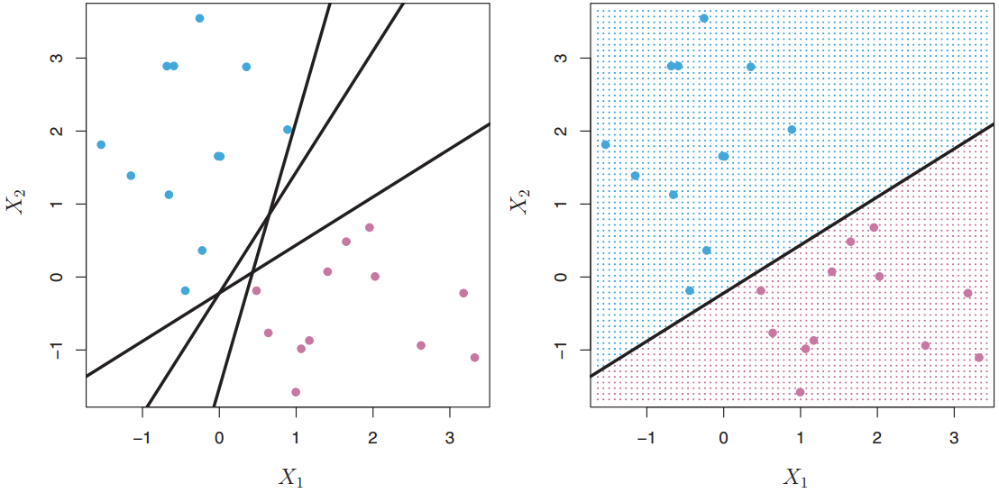
]

.small[
*Слева*: наблюдения двух классов и три разделяющие гиперплоскости из многих возможных   
*Справа*: правило принятия решения показано фоном    
]

---

.left-column[
.small[
*Чёрная прямая*: гиперплоскость с максимальным зазором  
  
*Стрелками* показаны опорные векторы  
]
]

.right-column[
.center[
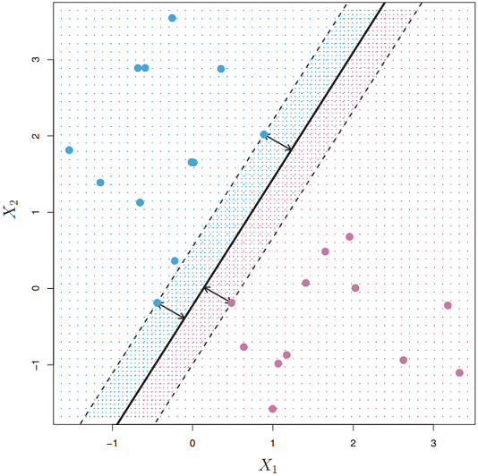
]
]

---

**Метод решения задачи 1**  

$$\max_{\beta_0, \beta_1,..., \beta_p} {M}$$

$$\begin{cases} \begin{align} & y_i \bigg( \beta_0 + \beta_1 x_{i1} + \beta_2 x_{i2} + \cdots + \beta_p x_{ip} \bigg) \ge M \\ & \qquad \qquad \qquad \qquad \qquad \forall i = 1,...,n, \\ & \sum_{j=1}^p {\beta_j^2 = 1.} \end{align} \end{cases}$$
*Смысл ограничений*: все наблюдения лежат по правильную сторону от гиперплоскости и не ближе чем на расстоянии $M$ от неё.   

---

.left-column[
.small[
Граница между классами нелинейна, классификатор с максимальным зазором неприменим.  
]
]

.right-column[
.center[
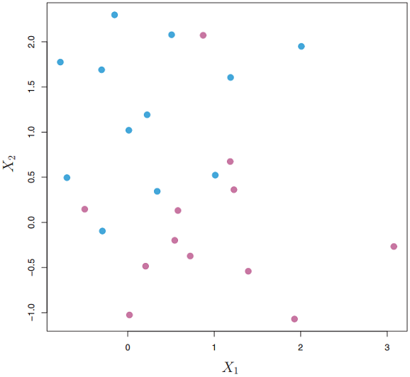
]
]

---

.center[
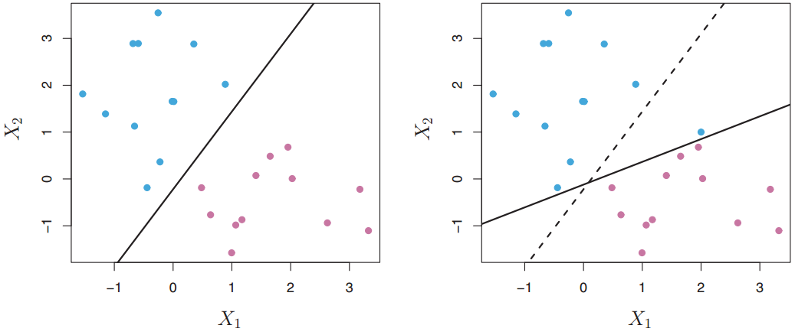
]

.small[
Метод неустойчив к изменению входных данных и склонен к переобучению.  
*Справа*: смещение исходной гиперплоскости (пунктир) при добавлении одного наблюдения синего класса. Минимальный зазор стал гораздо меньше.   
]

---

# План лекции   

- Классификатор с максимальным зазором   
- Классификаторы на опорных векторах  
--  
- Машины опорных векторов   

---

## Классификатор с мягким зазором  

- Не стремится чётко классифицировать все наблюдения  
- Более высокое качество классификации *большинства* наблюдений   
- Более устойчив к отдельным наблюдениям   

---

.center[
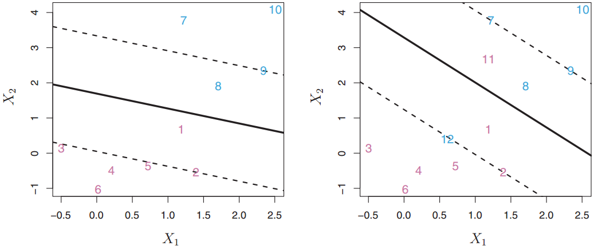
]

.small[
Классификатор с мягким зазором: сплошная линия – гиперплоскость, пунктир – границы зазора.       
*Слева*: наблюдения 1, 8 лежат на неправильной стороне относительно зазора.    
*Справа*: наблюдения 11, 12 лежат на неправильной стороне гиперплоскости (неверная классификация).    
]

---

**Классификатор с мягким зазором**

$$\max_{\beta_0, \beta_1,..., \beta_p, \epsilon_1,...,\epsilon_n} {M}$$

$$\begin{cases} \begin{align} & y_i \bigg( \beta_0 + \beta_1 x_{i1} + \cdots + \beta_p x_{ip} \bigg) \ge M(1 - \epsilon_i) \\ & \qquad \qquad \qquad \qquad \qquad \forall i = 1,...,n, \\ & \epsilon_i \ge 0, \, \, \, \sum_{i = 1}^n {\epsilon_i} \le C, \, \, \, \sum_{j=1}^p {\beta_j^2 = 1.} \end{align} \end{cases}$$

.small[
$\epsilon_i$ – фиктивные переменные: $\epsilon_i = 0 \Rightarrow$ верная сторона по гиперплоскости и зазору; $\epsilon_i > 0 \Rightarrow$ зазор нарушен, $\epsilon_i > 1 \Rightarrow$ гиперплоскость нарушена. Параметр $C$ – "параметр стоимости" (*cost parameter*), допустимое число нарушений.     
]

---

.center[
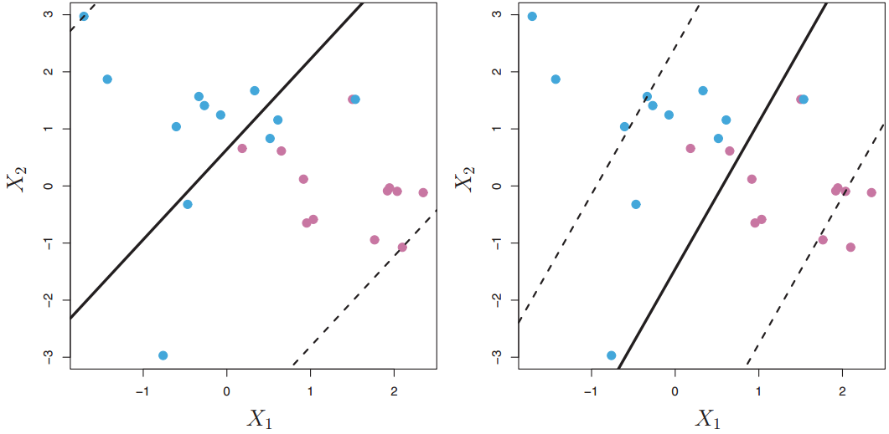
]

.small[
Классификатор на опорных векторах с разными значениями гиперпараметра: слева $C$ больше, зазор шире.   
На неправильной стороне гиперплоскости могут находиться не более $C$ наблюдений.
]

---

**Классификатор с мягким зазором**

- $C$ подбираем перекрёстной проверкой    
- при небольших $C$ зазор узкий, граница нарушается редко, $\Rightarrow$ хорошая аппроксимация, но высокая дисперсия    
- при больших $C$ низкая дисперсия, но плохая аппроксимация    
- на гиперплоскость влияют только наблюдения, которые лежат на границах зазора или нарушают их – **опорные вектора** $\Rightarrow$ метод устойчив к наблюдениям, далёким от гиперплоскости    
- задача оптимизации решается на скалярных произведениях наблюдений: $\langle x_i, x_{i'} \rangle = \sum_{j = 1}^n x_{ij} x_{i'j}$     

---

# План лекции   

- Классификатор с максимальным зазором   
- Классификаторы на опорных векторах  
- Машины опорных векторов  
--  

---

**Классификатор с нелинейной границей**

.center[
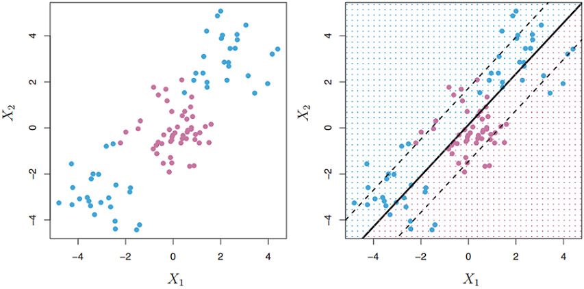
]

.small[
Можно расширить пространство предикторов с помощью полиномов. Например, для $X_1, X_2,...,X_n$ построить классификатор по $X_1, X_1^2, X_2, X_2^2,...,X_p,X_p^2$
]

---

## Машина опорных векторов (SVM)  

- пространство векторов расширяется за счёт **ядерных функций** различной формы    

- вычислительная сложность классификатора с мягким зазором резко возрастает: можем получить бесконечную размерность пространства признаков    

- SVM требует вычислить значение ядерной функции для скалярных произведений только уникальных пар наблюдений    

---

**Машина опорных векторов (SVM)**

Линейный классификатор на опорных векторах:   

$$f(x) = \beta_0 + \sum_{i = 1}^n \alpha_i \langle x, x_i \rangle$$

$\alpha_i$ – по одному параметру на каждое обучающее наблюдение $x_i$    
$\alpha_i \ne 0$ только для опорных векторов с индексами из множества $S$:   

$$f(x) = \beta_0 + \sum_{i \in S}^n \alpha_i \langle x, x_i \rangle$$

---

**Машина опорных векторов (SVM)**

Заменим скалярное произведение ядерной функцией (ядром):   

$$K(x_i, x_{i'})$$

- линейное ядро: $K(x_i, x_{i'}) = \sum_{j = 1}^p x_{ij} x_{i'j}$     

- полиномиальное: $K = \bigg ( 1 + \sum_{j = 1}^p x_{ij} x_{i'j} \bigg )^d$     

- радиальное: $K = \mathrm{exp} \bigg ( - \gamma \sum_{j = 1}^p (x_{ij} - x_{i'j})^2 \bigg )$, где $\gamma > 0$    

---

.center[
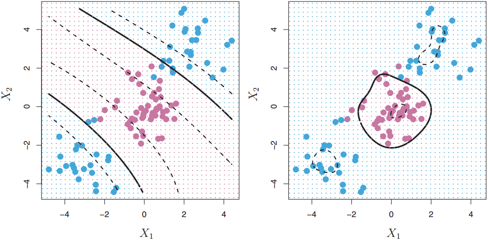
]

.small[
*Слева*: SVM-классификатор на основе полиномиального ядра 3 степени     
*Справа*: SVM-классификатор с радиальным ядром   
]

---

**Иллюстрация роли ядерной функции**

.center[
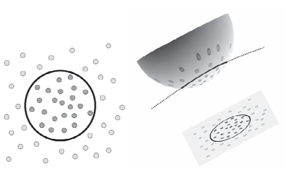
]

Ядерная функция проецирует наблюдения на пространство, в котором разделяющая граница между классами является прямой   

---

.left-column[
Данные <font color = "brown" family = "Courier New">iris</font>   
SVM с радиальной ядерной функцией   
  
$\gamma = 0.2$ даёт мягкую границу между классами   
]

.right-column[
.center[
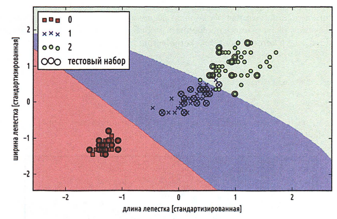
]
]

---

.left-column[
Данные <font color = "brown" family = "Courier New">iris</font>   
SVM с радиальной ядерной функцией,   
  
$\gamma = 100.0$ даёт компактную границу   
]

.right-column[
.center[
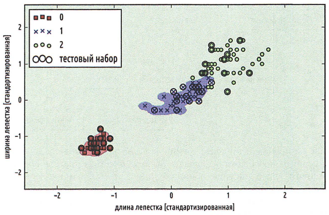
]
]

---

.center[

]

.small[
Данные <font color = "brown" family = "Courier New">Heart</font>, **обучающая выборка**     
На обучающих данных качество модели линейного дискриминантного анализа (LDA) и SVM примерно одинаковое    
]

---

.center[
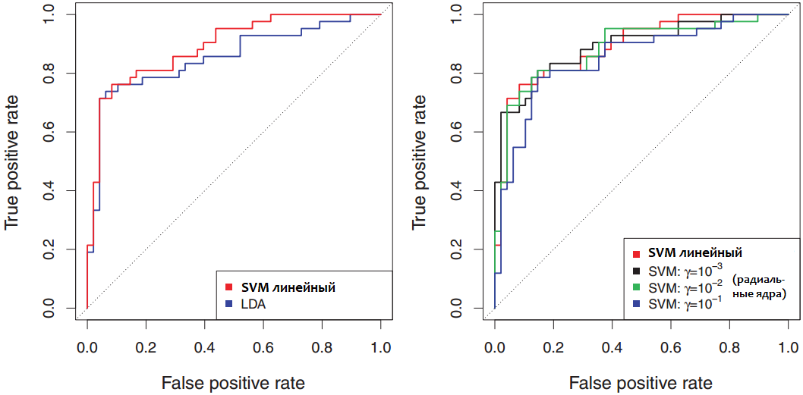
]

.small[
Данные <font color = "brown" family = "Courier New">Heart</font>, **тестовая выборка**     
На тестовой выборке более гибкий SVM ведёт себя хуже, чем на обучающей   
]

---

## Сходства с другими методами  

- Постановку задачи оптимизации SVM можно переписать в форме целевой функции со штрафом, близкой к гребневой регрессии    

- SVM и логистическая регрессия ведут себя похожим образом на наблюдениях, далёких от решающей границы     

- Исторически сложилось, что нелинейные ядра применяют в SVM, однако это возможно и в регрессионных методах    

---

## Ограничения SVM  

- Гарантированное переобучение на малых наборах данных   

- При сильном смешении классов результаты сомнительны, т.к. метод не даёт информации о вероятности ошибочной классификации для элемента данных  

- Сложности с мультиклассовой классификацией (т.к. классификация происходит на две группы за раз)   

---

## SVM с несколькими классами  

Наиболее популярные подходы:   

- **один против одного** – строим $K(K-1)/2$ машин, сравнивая все классы попарно; наблюдение относится к классу, который чаще всего присваивался во всех парных сравнениях    

- **один против всех** – строим $K$ машин, каждый раз сравнивая класс $K$ с остальными $K-1$ классами; наблюдение относится к классу с наибольшим значением ядерной функции    

---

## Сеточный поиск (grid search)   

 – настройка модели путём перебора параметров.   

1. Выбрать оценку качества модели ( $AUC$, $AIC$, $MSE_{ТЕСТ}$, $Acc_{ТЕСТ}$ и др.)    

1. Выбрать алгоритм и определить, какие параметры нужно оптимизировать    

1. Задать сетку: интервал изменения и шаг для каждого параметра    

1. Для каждой комбинации настроечных параметров рассчитать оценку качества с перекрёстной проверкой   

1. Выбрать лучшую модель по оценке качества   

---

**Источники**

1. *Джеймс Г.*, *Уиттон Д.*, *Хасти Т.*, *Тибширани Р.* Введение в статистическое обучение с примерами на языке R. Пер. с англ. С.Э. Мастицкого – М.: ДМК Пресс, <b>2016</b> – 450 с.  

1. *Бринк Х., Ричардс Дж., Феверолф М.* Машинное обучение. – Спб.: Питер, **2018**. – 336 с.   

1. *Анналин Ын, Кеннет Су* Теоретический минимум по Big Data. Всё, что нужно знать о больших данных. – Спб.: Питер, **2019**. – 208 с. 

1. Данные [Heart](https://web.stanford.edu/~hastie/ElemStatLearn/data.html), [iris](https://scikit-learn.org/stable/auto_examples/datasets/plot_iris_dataset.html). 
